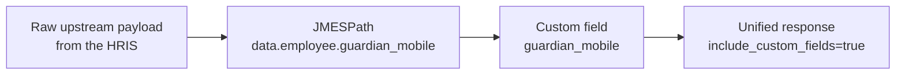
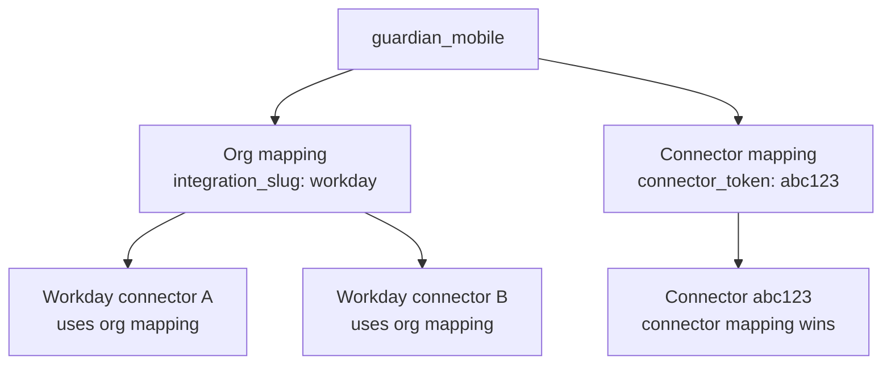

A unified model has a fixed schema. An `employee` always exposes `first_name`, `email`, and so on. Custom Fields let you add your own attributes, such as `guardian_mobile`, and tell Bindbee where to read them from in the third party's raw response.



## Building blocks

| Term | What it is |
| --- | --- |
| **Custom field** | A named extension on a unified model, belonging to a `(category, model)` pair such as `(HRIS, employee)`. |
| **Mapping** | The rule that tells Bindbee where to read the value from in the raw payload. |
| **JMESPath** | The expression language used to point at a value inside the raw JSON. See [jmespath.org](https://jmespath.org/). |

A field carries no data until it has a mapping. A mapping carries a scope.

## Scopes

| Scope | Applies to | Set with |
| --- | --- | --- |
| **Organization level** | Every connector of that integration in your org | `integration_slug` |
| **Connector level** | One connector instance | `connector_token` |



<Info>
  When both levels exist for the same field, the **connector level** mapping overrides the organization level one on that connector.
</Info>

## Choose how to configure

Both routes create the same underlying configuration and can coexist.

<CardGroup cols={2}>
  <Card title="Dashboard Configuration" icon="monitor" href="/guides/extending/custom-fields/dashboard">
    Visual flow with a raw JSON viewer and employee search. Best for ad hoc setup and one off changes.
  </Card>

  <Card title="API Configuration" icon="code" href="/guides/extending/custom-fields/api-workflow">
    Programmatic flow for automation, version control, and replicating config across environments.
  </Card>
</CardGroup>

<Note>
  Fields are tagged `source: "API"` or `source: "DASHBOARD"` depending on where they were created. Both behave identically and appear together in lookups and responses.
</Note>

## Retrieve custom fields

Once a field has a mapping that resolves on a connector, add `include_custom_fields=true` to any unified request.

<CodeGroup>
```http Request
GET https://api.bindbee.dev/api/hris/v1/employees?include_custom_fields=true
```

```json Response
{
  "id": "emp_123",
  "name": "John Doe",
  "custom_fields": {
    "guardian_mobile": "+1-555-123-4567",
    "cost_center_name": "Engineering-NA",
    "hourly_rate": 45.0
  }
}
```
</CodeGroup>

<Warning>
  An invalid or unresolvable JMESPath does not raise an error. The response returns `"INVALID_JSON_PATH"` in place of the value. Validate before saving, using the dashboard preview button or the API [preview endpoint](/guides/extending/custom-fields/api-workflow#step-3-validate-the-jmespath).
</Warning>

## Best practices

<CardGroup cols={2}>
  <Card title="Name fields clearly" icon="tag">
    snake\_case, descriptive. Avoid `custom1`, `custom2`.
  </Card>

  <Card title="Preview every expression" icon="eye">
    Check the resolved value and its type before saving the mapping.
  </Card>

  <Card title="Scope deliberately" icon="layers">
    Org level for data consistent across an integration, connector level for overrides. Check for an existing org mapping before duplicating it.
  </Card>

  <Card title="Automate and verify" icon="refresh-cw">
    Keep config in version control via the API. Run the `configuration` endpoint after provisioning a connector to confirm every field is mapped.
  </Card>
</CardGroup>

<Tip>
  Data structures differ across integrations. An expression that works for one platform will not always work for another, so check type consistency across connectors of the same integration.
</Tip>

For the full expression syntax, see the [JMESPath documentation](https://jmespath.org/).
