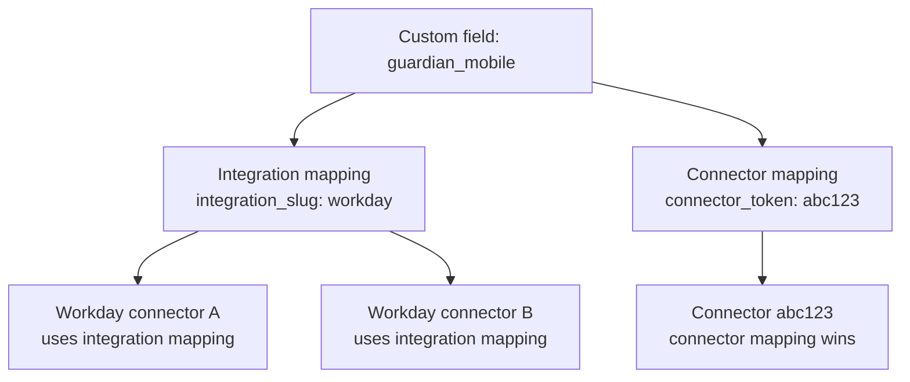

A unified model has a fixed schema. An `employee` always exposes `first_name`, `email`, and so on. Custom Fields let you add your own attributes, such as `guardian_mobile`, and tell Bindbee where to read them from in the third party's raw response.

## Building blocks

| Term | What it is |
| --- | --- |
| **Custom field** | A named extension on a unified model, belonging to a `(category, model)` pair such as `(HRIS, employee)`. |
| **Mapping** | The rule that tells Bindbee where to read the value from in the raw payload. |
| **JMESPath** | The expression language used to point at a value inside the raw JSON. See [jmespath.org](https://jmespath.org/). |

A field carries no data until it has a mapping. Every mapping has a type.

## Type of mapping

| Mapping type | Applies to | Set with | Called in the dashboard |
| --- | --- | --- | --- |
| **Integration level** | Every connector of that integration in your org | `integration_slug` | **for Integration** |
| **Connector level** | One connector instance | `connector_token` | **for Specific Connector** |

<Info>
  When both levels exist for the same field, the **connector level** mapping overrides the integration level one on that connector.
</Info>



## Choose how to configure

You can manage Custom Fields in two ways. Both create the same underlying configuration and can coexist — pick whichever fits the task.

<CardGroup cols={2}>
  <Card title="Dashboard Configuration" icon="layout-dashboard" href="/guides/extending/custom-fields/dashboard">
    Visual flow with a raw JSON viewer and employee search. Best for ad hoc setup and one-off field changes.
  </Card>

  <Card title="API Configuration" icon="code" href="/guides/extending/custom-fields/api-workflow">
    Programmatic flow for automation, version control, and replicating config across environments.
  </Card>
</CardGroup>

Whichever route you use, what you send on the mapping decides its type. Send `integration_slug` and Bindbee maps at the integration level; send `connector_token` and it maps at the connector level. The two are mutually exclusive — provide exactly one.

## Retrieve custom fields

Once a field has a mapping that resolves on a connector, add `include_custom_fields=true` to any unified request.

<CodeGroup>
```http Request
GET https://api.bindbee.dev/api/hris/v1/employees?include_custom_fields=true
```

```json Response
{
  "id": "emp_123",
  "name": "John Doe",
  "custom_fields": {
    "guardian_mobile": "+1-555-123-4567",
    "cost_center_name": "Engineering-NA",
    "hourly_rate": 45.0
  }
}
```
</CodeGroup>

<Warning>
  An invalid or unresolvable JMESPath does not raise an error. The response returns `"INVALID_JSON_PATH"` in place of the value. Validate before saving, using the dashboard preview button or the API [preview endpoint](/guides/extending/custom-fields/api-workflow#step-3-validate-the-jmespath).
</Warning>

## Best Practices

1. **Naming Conventions**

   - Use clear, descriptive names.
   - Follow **snake_case** formatting.
   - Avoid generic names like `custom1`, `custom2`.

2. **JMESPath Expressions**

   - Always preview an expression before saving it.
   - Consider data type consistency across connectors of the same integration.

3. **Integration vs Connector Level Mapping**

   - Use **Integration Level** mappings for data that's consistent across all connectors of an integration.
   - Use **Connector Level** mappings for connector-specific overrides.
   - Review existing **Integration Level** mappings before creating connector-level duplicates.

4. **Automation**

   - Use the [API Configuration](/custom-fields/api-workflow) flow to keep custom field configuration in version control or replicate it across environments (dev → staging → prod).
   - The `configuration` endpoint is a good health check — run it after provisioning a new connector to confirm every expected field has a mapping.

For the full expression syntax, see the [JMESPath documentation](https://jmespath.org/).