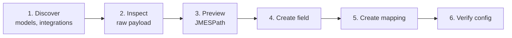

The Custom Fields API exposes the same capabilities as the dashboard. For the concepts see the [Custom Fields overview](/guides/extending/custom-fields). For the visual route see [Dashboard Configuration](/guides/extending/custom-fields/dashboard).



## Authentication

All Custom Fields endpoints are scoped to your organization.

```http Headers
Authorization: Bearer <YOUR_API_KEY>
Content-Type: application/json
```

<Note>
  Fields created here are tagged `source: "API"`. Dashboard fields are tagged `source: "DASHBOARD"`. Both coexist and behave identically.
</Note>

The steps below use a running example: extending the `employee` model with `guardian_mobile`, populated from a Workday connector.

## Step 1: Discover models and integrations

Lookup endpoints return only what your organization has access to.

```bash
GET /api/v1/lookup/models?category=HRIS
GET /api/v1/lookup/integrations?category=HRIS
```

```json Example responses
// /api/v1/lookup/models
{ "models": [{ "slug": "employee", "display_name": "Employee", "category": "HRIS" }] }

// /api/v1/lookup/integrations
{ "integrations": [{ "slug": "workday", "display_name": "Workday", "categories": ["HRIS"] }] }
```

<Note>
  Connector tokens are **not** returned by any lookup endpoint. They are issued when a connector is created and surfaced through the connector flow.
</Note>

## Step 2: Inspect the raw payload

`raw-data` returns the connector's latest synced row, or a canned integration sample when no connector is given or it has not synced yet.

```bash
# Using a real connector
GET /api/v1/custom-fields/raw-data?category=HRIS&model=employee&connector_token=<CONNECTOR_TOKEN>

# Or just the integration sample
GET /api/v1/custom-fields/raw-data?category=HRIS&model=employee&integration_slug=workday
```

```json Response
{
  "data": {
    "employee": {
      "id": "emp_123",
      "first_name": "Ada",
      "guardian_mobile": "+1-555-123-4567"
    }
  }
}
```

Here the JMESPath you want is `data.employee.guardian_mobile`.

## Step 3: Validate the JMESPath

Preview evaluates an expression against real connector data **without** persisting anything. Optional, but it is what keeps `INVALID_JSON_PATH` out of production responses.

```bash
POST /api/v1/custom-fields/preview
```

<CodeGroup>
```json Request body
{
  "connector_token": "<CONNECTOR_TOKEN>",
  "category": "HRIS",
  "model": "employee",
  "json_path": "data.employee.guardian_mobile"
}
```

```json Response
{
  "connector_token": "<CONNECTOR_TOKEN>",
  "json_path": "data.employee.guardian_mobile",
  "resolved_value": "+1-555-123-4567",
  "resolved_value_type": "string",
  "raw_data_source": "connector_sync"
}
```
</CodeGroup>

| Field | Possible values |
| --- | --- |
| `raw_data_source` | `connector_sync` (the connector's latest synced row), `integration_sample` (connector has not synced, fell back to the canned sample), `inline` (the request supplied an inline `raw_data` payload) |
| `resolved_value_type` | `string`, `number`, `boolean`, `object`, `array`, `null` |

## Step 4: Create the custom field

The field is a typed slot on the `(category, model)`. It carries no mapping yet.

```bash
POST /api/v1/custom-fields
```

<CodeGroup>
```json Request body
{
  "name": "guardian_mobile",
  "description": "Employee's guardian mobile number",
  "category": "HRIS",
  "model": "employee"
}
```

```json Response
{
  "id": "018e586b-7d0b-7bc9-be65-a8fdbc82d734",
  "status": "SUCCESS"
}
```
</CodeGroup>

<Note>
  `name` must be **snake\_case**, 2 to 128 characters, and unique within the `(category, model)`.
</Note>

## Step 5: Create a mapping

A mapping pairs the field with a JMESPath, scoped either to an integration or to a single connector.

```bash
POST /api/v1/custom-fields/mapping
```

<CodeGroup>
```json Organization-scoped
{
  "custom_field_id": "018e586b-7d0b-7bc9-be65-a8fdbc82d734",
  "integration_slug": "workday",
  "json_path": "data.employee.guardian_mobile"
}
```

```json Connector-scoped
{
  "custom_field_id": "018e586b-7d0b-7bc9-be65-a8fdbc82d734",
  "connector_token": "<CONNECTOR_TOKEN>",
  "json_path": "data.employee.guardian_mobile"
}
```

```json Response
{
  "id": "018e586b-7d0b-7bc9-be65-a8fdbc82d734",
  "status": "SUCCESS"
}
```
</CodeGroup>

Organization scope applies to every Workday connector in your org. Connector scope applies to one connector and overrides any org level mapping for that field.

<Warning>
  Provide **exactly one** of `integration_slug` or `connector_token`. Only `json_path` is mutable, so to change scope, delete the mapping and create a new one.
</Warning>

## Step 6: Verify the effective configuration

Returns every custom field for a `(connector, category, model)` with the mapping actually in use. Connector mappings override organization ones, and unmapped fields are included with `json_path: null` so you can see what is left to configure.

```bash
GET /api/v1/custom-fields/configuration?connector_token=<CONNECTOR_TOKEN>&category=HRIS&model=employee
```

```json Response
{
  "connector_token": "<CONNECTOR_TOKEN>",
  "integration_slug": "workday",
  "category": "HRIS",
  "model": "employee",
  "fields": [
    {
      "custom_field_id": "018e586b-7d0b-7bc9-be65-a8fdbc82d734",
      "name": "guardian_mobile",
      "description": "Employee's guardian mobile number",
      "category": "HRIS",
      "model": "employee",
      "json_path": "data.employee.guardian_mobile",
      "source": "organization",
      "mapping_id": "018e586b-7d0b-7bc9-be65-a8fdbc82d734"
    },
    {
      "custom_field_id": "...",
      "name": "favorite_color",
      "description": null,
      "category": "HRIS",
      "model": "employee",
      "json_path": null,
      "source": null,
      "mapping_id": null
    }
  ]
}
```

| `source` | Meaning |
| --- | --- |
| `connector` | A connector scoped mapping is in effect. |
| `organization` | No connector override, the org scoped mapping is inherited. |
| `null` | No mapping is configured for this field on this connector. |

## Update and delete

| Action | Endpoint | Notes |
| --- | --- | --- |
| List custom fields | `GET /api/v1/custom-fields` | Filter by `category`, `model`, `source`. |
| Get one with mappings | `GET /api/v1/custom-fields/{id}` | Returns the field plus all its mappings. |
| Delete a field | `DELETE /api/v1/custom-fields/{id}` | Cascades. All mappings for the field are removed. |
| Update a mapping | `PATCH /api/v1/custom-fields/mapping/{id}` | Only `json_path` is mutable. Re-create to change scope. |
| Delete a mapping | `DELETE /api/v1/custom-fields/mapping/{id}` | Removes one mapping. The field is unaffected. |

## Next steps

<CardGroup cols={2}>
  <Card title="Retrieve custom fields" icon="download" href="/guides/extending/custom-fields#retrieve-custom-fields">
    Add `include_custom_fields=true` to your unified requests.
  </Card>

  <Card title="Best practices" icon="lightbulb" href="/guides/extending/custom-fields#best-practices">
    Naming, scoping, and automation guidance.
  </Card>
</CardGroup>
