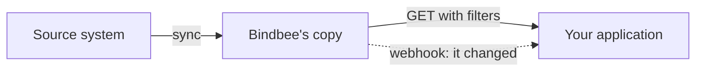

{/* CONTENT PASS: new page. Router for the section - keep it short and let the pages below carry the detail. */}

Bindbee holds a synced copy of your customer's data. **Everything you read comes from that copy, not from a live call to the source system** - which is the single fact that explains most of what follows.

## The read path

Three things follow from it:

**Freshness is set by the sync, not by your request.** A record edited an hour ago is invisible until the next sync runs. Reading more often does not help - see [Syncing](/guides/reading-writing/syncing).

**Reads succeed even when syncing is broken.** A connector that stopped syncing weeks ago still returns `200` with stale data. Nothing in the response says so, so health has to be watched separately - see [Sync Status](/guides/troubleshooting/sync-status).

**A webhook is a signal, not a delivery.** Change events tell you something happened and give you enough to go and read it - see [Webhook](/guides/reading-writing/webhooks).

| To do this | Go here |
| --- | --- |
| Narrow a collection, or fetch only what changed | [Querying the data](/guides/reading-writing/querying-data) |
| Walk a whole collection | [Pagination](/api-reference/basics/pagination) |
| Understand the identifiers on every record | [id vs remote_id](/guides/reading-writing/record-identity) |
| Reach a value the unified model drops | [Raw Data](/guides/reading-writing/raw-data) |
| Control when data refreshes | [Syncing](/guides/reading-writing/syncing) |
| Learn that something changed | [Webhook](/guides/reading-writing/webhooks) |

## The write path

Writing does not go through the copy. **A write is submitted to the source system and reports what came back**, which makes it asymmetric with reading in three ways.

**The request shape is not fixed.** What a system requires to create an employee differs by system, and by tenant within a system. You ask the connector for the schema first - see [Meta APIs](/guides/reading-writing/meta-apis).

**Not every model accepts writes**, and support varies by integration.

**Failures are business failures.** Insufficient leave balance, a closed payroll period, a mandatory custom field - none are conditions Bindbee can evaluate in advance, and the useful message is the source system's own.

<Warning>
  Retrying a write without `X-Idempotency-Key` can create a duplicate in the customer's HRIS. A `5xx` may be returned *after* the record was created - see [Errors & Issues](/guides/troubleshooting/errors-and-issues).
</Warning>

## Related

- [Core concepts](/get-started/core-concepts) - what a model, record and connector are
- [Data Models](/guides/data-models/employee-and-org) - what each model contains
- [Scoping](/get-started/scoping) - why a field can be absent entirely
