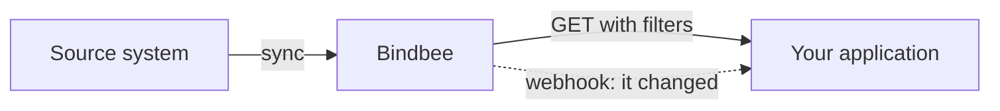

Every list endpoint answers from the connected system's last completed sync.

## How a read works



**Freshness is set by the sync, not by your request.** A record edited an hour ago is invisible until the next sync runs - see [Syncing](/guides/reading-writing/syncing).

**Reads succeed even when syncing is broken.** A connector that stopped syncing weeks ago still returns `200` with stale data. Nothing in the response says so, so health has to be watched separately - see [Sync Status](/guides/troubleshooting/sync-status).

Change events tell you a record moved, and carry enough to go and read it - see [Webhooks](/guides/reading-writing/webhooks).

Every request needs your [API key](/api-reference/basics/authentication#where-to-find-them) and the [connector token](/api-reference/basics/authentication#where-to-find-them) for the end customer whose data you are reading:

```bash
curl -X GET "https://api.bindbee.dev/api/hris/v1/employees" \
  -H "Authorization: Bearer <BINDBEE_API_KEY>" \
  -H "X-Connector-Token: <CONNECTOR_TOKEN>"
```

---

## Query parameters

Query parameters control what comes back. They work alongside `cursor` and `page_size`, and combine in a single request.

<CardGroup cols={3}>
  <Card title="Filters" icon="funnel" href="/guides/reading-writing/reading-data/filters">
    Narrow the result set to the records you care about.
  </Card>

  <Card title="Expand" icon="expand" href="/guides/reading-writing/reading-data/expand">
    Return related objects inline instead of just their IDs.
  </Card>

  <Card title="modified_after" icon="history" href="/guides/reading-writing/reading-data/modified-after">
    Return only records updated since a point in time.
  </Card>
</CardGroup>

---

## Putting it together

Filters, `expand`, `modified_after` and pagination all compose in a single request:

```bash
curl -X GET "https://api.bindbee.dev/api/hris/v1/employees?\
employment_status=ACTIVE&\
modified_after=2024-02-21T21:22:12.993Z&\
expand=manager[first_name,last_name],work_locations&\
include_custom_fields=true&\
page_size=200" \
  -H "Authorization: Bearer <BINDBEE_API_KEY>" \
  -H "X-Connector-Token: <CONNECTOR_TOKEN>"
```

That request returns active employees changed since the given timestamp, 200 records per page.

---

## Related

<CardGroup cols={2}>
  <Card title="Pagination" icon="list" href="/api-reference/basics/pagination">
    Page through large result sets with `cursor` and `page_size`.
  </Card>

  <Card title="Syncing" icon="refresh-cw" href="/guides/reading-writing/syncing">
    How often Bindbee pulls fresh data from each connector.
  </Card>

  <Card title="Webhooks" icon="webhook" href="/guides/reading-writing/webhooks">
    Get notified when data is created or modified instead of polling.
  </Card>

  <Card title="Custom fields" icon="table" href="/guides/extending/custom-fields">
    Extend unified models with fields specific to your use case.
  </Card>
</CardGroup>
