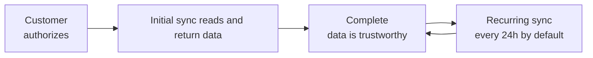

Bindbee syncs data from each connected system on a schedule, normalizes it into the unified models, and stores it. **Your API calls read from that stored copy**, so data is as current as the last completed sync.

## The initial sync



The initial sync starts the moment your end user completes authentication, however the connection was created — see [How to connect](/get-started/how-to-connect). Until it finishes, reads return `200` with partial data and nothing on the response says so.

You can watch its progress on the connector with [Get Connectors](/api-reference/connectors/get-connectors). That endpoint scopes by a `connector_token` **query parameter**, not the usual header.

Two status fields on the connector answer different questions:

| Field | Values | Describes |
| --- | --- | --- |
| `status` | `COMPLETE`, `INCOMPLETE`, `RELINK_NEEDED` | The link status of the connector |
| `sync_status` | `Syncing`, `Done`, `Failed` | The status of the most recent sync job |

A connector can be `COMPLETE` and still hold no data, because the two are independent.

The dashboard uses its own words for the same field. It shows **Synced** where `sync_status` is `Done`, and **Partial** for a run that loaded some models and failed others, which is not a `sync_status` value at all - see [Sync status](/guides/troubleshooting/sync-status).

Rather than polling, subscribe to the `connector_synced` [webhook](/guides/reading-writing/webhooks). It fires when a sync job finishes successfully — the cleanest signal that a newly connected account is ready to use.

## The recurring schedule

After the initial sync, a Production connector syncs again automatically, **once every 24 hours by default**. Nothing is required from you or your end user. The interval is configurable on request — see [Sync frequency](/api-reference/basics/sync-frequency).

`last_sync_start_time` is when the most recent job began; `next_sync_start_time` is when the next scheduled one will.

Every webhook payload carries a `sync` object identifying the job behind it, and `sync_type` is `AUTOMATED` for a scheduled run or `MANUAL` for one you triggered. That distinction is worth using: if you force a sync in response to a user action, you can match the resulting webhook back to that action rather than treating it as routine traffic. See [Events & payloads](/guides/reading-writing/webhooks).

<Note>
  Frequency bounds when data *changes*, not how often you can read. Call the API as often as you like within your [rate limits](/api-reference/basics/rate-limits) — the data will not differ between syncs.
</Note>

## Development connectors

Development connectors run the same initial sync as Production ones: it starts on authorization and needs nothing from you. What they do **not have is the recurring schedule** that follows it. After that first run the data is frozen until you trigger a sync yourself. See [Environments](/get-started/environments) for everything else the two differ on.

## Forcing a resync

When you need data sooner than the next scheduled run — and always, in Development, after the first one:

```bash
curl -X POST https://api.bindbee.dev/api/embedded/v1/connectors/resync \
  -H "Authorization: Bearer <BINDBEE_API_KEY>" \
  -H "X-Connector-Token: <CONNECTOR_TOKEN>"
```

Unlike the connector list above, [this endpoint](/api-reference/connectors/resync-connector) scopes by header. To know when the data has landed, listen for `connector_synced` or poll `sync_status` until it returns to `Done`.

**When force sync needed:**

* Your end user changed something in their HRIS and expects to see it straight away.
* You completed a write and go to the source system, so a sync has to pick them up before they are readable.
* You changed a [custom field](/guides/extending/custom-fields) mapping and want existing records populated.
* You are investigating a discrepancy for one customer.


## Triggering a job on completion

Reading on a timer instead goes wrong in four ways:

* A paginated walk shifts under you mid-sync.
* Counts come back short.
* A census extract is quietly incomplete.
* A stalled connector looks identical to a quiet one.

Gate the work on `connector_synced` rather than a clock. The event names the connector and the sync job, so a handler can process exactly what finished — and pair it with `modified_after` to read only what that run touched, as in [modified_after](/guides/reading-writing/reading-data/modified-after).

For creating the subscription, the payload shape and delivery guarantees, see [Webhooks](/guides/reading-writing/webhooks).

## When a sync fails

A failed job sets `sync_status` to `Failed` and fires the `connector_sync_error` webhook, whose payload carries an `error` object with the failure time and a summary.

**Previously synced data stays readable throughout.** A failure means your copy is stale, not missing — which is also why a broken connector does not announce itself on your reads, and has to be watched separately. See [Monitor sync status](/guides/troubleshooting/sync-status) for what to alert on and how to diagnose a specific failure.

If `status` has become `RELINK_NEEDED`, the credentials themselves stopped working and your end user must reconnect before syncing resumes — see [Connections to relink](/guides/troubleshooting/connector-relink).

## Related

<CardGroup cols={2}>
  <Card title="Sync frequency" icon="refresh-cw" href="/api-reference/basics/sync-frequency">
    How often a connector syncs, and how to change it.
  </Card>

  <Card title="Force Resync a Connector" icon="zap" href="/api-reference/connectors/resync-connector">
    API reference for triggering a sync on demand.
  </Card>

  <Card title="Webhooks" icon="webhook" href="/guides/reading-writing/webhooks">
    Sync and data-change events, payloads, and delivery.
  </Card>

  <Card title="Monitor sync status" icon="scroll-text" href="/guides/troubleshooting/sync-status">
    What to track, and what to do when a sync fails.
  </Card>
</CardGroup>
