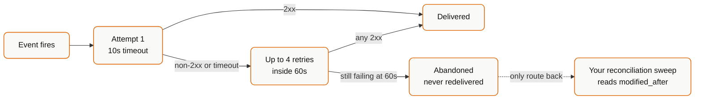

{/* CONTENT PASS: merged from webhooks/overview, webhooks/events, webhooks/delivery, how-to/reliability/distinguish-created-from-modified. The retry policy (4 attempts / 60s / 10s timeout) appears in three of the four sources - keep the table only. */}


Bindbee can notify you when a sync finishes and when records change, instead of your application polling to find out. Treating that as a real-time data feed produces a system that mostly works and occasionally loses data.

## Freshness and notification are separate

| Question | Determined by |
| --- | --- |
| How fresh is the data? | The sync cadence - every 24 hours by default |
| How do I learn it changed? | Webhooks or polling |

**No delivery mechanism makes data fresher than the sync allows.** If a customer needs hourly data, the sync frequency has to change - see [How syncing works](/guides/reading-writing/syncing).

## A webhook is a signal, not a delivery

Two kinds arrive: sync-status events saying a connector's sync completed or failed, and data-change events saying records were created or modified.

**Neither carries the data.** A change event tells you something happened and gives you enough to go and read it. Your handler's job is to fetch, not to consume a payload.

That is deliberate. A record carried in a webhook is a snapshot from the moment the event fired and may be stale by the time your handler runs. Fetching on receipt means you always act on current state, and keeps the API the single source of truth.

<Info>
Sync-status events are the more useful of the two and the more overlooked. They are the only reliable way to know an initial sync has finished, and the only push signal that a connector has stopped working.
</Info>

## Create a webhook

<Info>
  **Before you start** - a publicly reachable HTTPS endpoint that accepts `POST` and responds within 10 seconds.
</Info>

<Steps>
  <Step title="Prepare an endpoint that acknowledges immediately">
    Return `200` as soon as you've stored the payload, then process asynchronously.

    Each delivery attempt times out at 10 seconds, and every non-`2xx` counts as a failure. An endpoint that does its work before responding will start failing under exactly the load where you need it most.
  </Step>

  <Step title="Add the destination and test it">
    Go to **Configure → Webhooks** and open **New webhook**. Enter your destination URL, then click **Test URL** to confirm Bindbee can reach it before any real event depends on it.
  </Step>

  <Step title="Name it and set the type">
    Give it a descriptive name - that is how you'll identify it later when several exist. Then set the type:

    | Type | Receives events for |
    | --- | --- |
    | Production | Production connectors |
    | Development | Development connectors |

    <Warning>
      This is the most common webhook mistake. A Production webhook is silent for every Development connector, and the reverse. Testing against a Development connector requires a Development webhook.
    </Warning>
  </Step>

  <Step title="Select events">
    Choose which events to receive - see [Events & payloads](/guides/reading-writing/webhooks) for what each one does and when it fires.
  </Step>

  <Step title="Create and verify">
    Click **Create webhook**, then trigger a sync on a connector in that environment and confirm the payload arrives - see [Force a resync](/guides/reading-writing/syncing).
  </Step>
</Steps>

The **Security** section on the same screen holds your signature key. Verify every delivery before acting on it - see [Signatures & delivery](/guides/reading-writing/webhooks).

## When polling is the better instrument

You poll **Bindbee, not the source system**, so it costs nothing upstream and cannot exhaust a vendor's rate limit. Bindbee's own limit is 200 requests per minute per connector.

Polling every five minutes against a 24-hour sync produces 288 identical responses a day. Time it off the schedule instead:

- **Poll the connector list, not the data endpoints.** One request returns every connector's `status`, `sync_status`, `last_sync_start_time` and `next_sync_start_time`.
- **Use `next_sync_start_time` to time the poll.** It tells you when new data will exist, so you read once after the sync lands rather than guessing an interval.
- **Then read with `modified_after`** for the connectors whose `last_sync_start_time` moved.

## What webhooks cannot tell you

**That nothing happened.** Silence is ambiguous - no events could mean no changes, a delivery failure, or a connector that broke three weeks ago.

**That you received everything.** Delivery is best-effort and the [retry window](/guides/reading-writing/webhooks#retry-mechanism) is 60 seconds. A deploy that takes your endpoint down for two minutes loses those events permanently, with no error in your logs or Bindbee's.

**Which field changed.** An event says a record changed, not which attribute or what it was before.

**That a record was deleted.** Disappearance is a non-event. Only a scheduled read finds it.

{/* VERIFY: ordering - can events for one connector arrive out of sequence? Retry behaviour is documented; ordering is not, and it determines whether a handler can trust event order or must re-read state. */}

## What this means for you

The durable pattern is both: webhooks to react quickly to what you hear about, and a scheduled read to catch what you did not. Both paths do the same thing - read with `modified_after`, upsert on `id` - so running both is one code path, not two, and harmless.

- **Fetch on receipt.** Do not build handlers around event payloads.
- **Run a scheduled reconciliation** however good your event handling is.
- **Poll the connector list**, timed off `next_sync_start_time`.
- **Gate first-run logic on sync-status events**, not on data appearing.
- **Make handlers idempotent** and respond within 10 seconds.
- **Register both environments.** Production webhooks never fire for Development connectors.

## If this didn't work

<AccordionGroup>
  <Accordion title="Nothing arrives">
    Check the environment first - it explains most silent webhooks. Then confirm the endpoint is reachable from the public internet, accepts `POST`, and isn't behind auth that rejects unauthenticated requests. Use **Test URL** to isolate reachability from event configuration.
  </Accordion>

  <Accordion title="Some events arrive and others don't">
    Confirm the missing event is selected on this webhook. Events fire on sync activity - a data-change event only fires when a sync actually changes data, so a run finding nothing new produces a sync-completed event with no data-change event.
  </Accordion>

  <Accordion title="Deliveries arrive intermittently">
    Bindbee retries up to 4 times within 60 seconds, with a 10-second timeout per attempt. Intermittent loss under load almost always means slow acknowledgement - see [Signatures & delivery](/guides/reading-writing/webhooks).
  </Accordion>

  <Accordion title="You need different endpoints for different events">
    Create several webhooks in the same environment, each with its own URL and event selection. Splitting sync-lifecycle events from data-change events is a common arrangement where different services consume them.
  </Accordion>
</AccordionGroup>

## Events & payloads

Five events are available. Subscribing to all of them is a common mistake - each one you take is a delivery you have to handle, and most integrations need two or three.

### The five events

| Dashboard label | Event string | Fires when |
| --- | --- | --- |
| Sync start | `connector_sync_started` | A sync begins |
| Sync completed | `connector_synced` | A sync finishes successfully |
| Sync error | `connector_sync_error` | A sync fails |
| Employee model change | `employee_data_changed` | Employee records are created or updated |
| Data model change | `connector_data_modified` | Records in any supported model are created or updated |

<Note>
Event strings use underscores. `connector-synced` is not a valid event name, and matching the wrong form fails quietly - your handler simply never runs.
</Note>

### Picking the ones you need

| Goal | Subscribe to |
| --- | --- |
| Run a job when fresh data lands | Sync completed |
| Detect breakage and prompt a relink | Sync error, plus Sync start to catch stalls |
| React to employee changes only | Employee model change |
| React to changes across benefits, payroll, employment | Data model change |
| Avoid reading mid-sync | Sync completed |
| Detect a sync that never started | Sync start |

Sync error alone is worth taking even if you keep your existing scheduled processing - it costs one handler and tells you when a customer's data has stopped updating.

### Resolving an event to your own customer

`origin_id` on the `connector` object is the identifier you set when generating the Magic Link. Use it to resolve an incoming event to your own customer record without a separate mapping table.

`sync_type` is `AUTOMATED` or `MANUAL`, which is how you tell a scheduled run from one you or support triggered. `sync_id` correlates the start, completion and error events for a single run.

### Change events return IDs, not records

Employee model change returns a flat array:

```json
"data": ["0190d9d8-ac9b-76cb-a5ee-df70994e6f3d"]
```

Data model change returns IDs grouped by model:

```json
"data": {
  "hris_bank_info": ["0190d9d8-cf5b-7ce4-b60f-1fd95c04adee"],
  "hris_employment": ["0190d9d9-023d-7259-97e1-b38682dec062"]
}
```

Fetch the records with `ids` - see [Filtering](/guides/reading-writing/querying-data). One batched request per model beats one request per ID, which is what exhausts the connector's rate limit on a large change set.

Payloads carry IDs by design. It keeps them small and avoids delivering a snapshot that is stale by the time your handler runs.

<Warning>
These events tell you a record was **created or updated**, without distinguishing between the two. If your logic differs - first-time enrolment versus a change to an existing one - see [Distinguish Created from Modified](/guides/reading-writing/webhooks).

{/* VERIFY: a created-vs-modified flag in the payload was committed to on the Clarity call. Confirm whether it shipped and update this page. */}
</Warning>

### Payload Properties

- `webhook`: Information about the webhook that was triggered.
- `connector`: Information about the connector associated with the event.
- `data`: The affected connector sync status data.
- `sync`: Information about the sync job that triggered the event. This object is included in all webhook payloads.
- `error`: Information about the sync failure. This object is included only in the `connector_sync_error` webhook.

#### Sync information

All webhook payloads include a top-level `sync` object in the following format:

```json
{
  "sync_id": "019f146e-8396-7c6d-aff3-c5760bf5eefe",
  "sync_type": "AUTOMATED",
  "sync_name": "#13"
}
```

| Field | Description |
| --- | --- |
| `sync_id` | The unique identifier of the sync job. |
| `sync_type` | How the sync was triggered. Possible values:`MANUAL` and `AUTOMATED`. |
| `sync_name` | The name assigned to the sync job. |

#### Sync error information

The `connector_sync_error` webhook includes a top-level `error` object in the following format:

```json
{
  "failed_at": "2026-07-07T11:21:35.837448+00:00",
  "message": "A runtime error occurred during the sync process. Bindbee team has been notified.",
  "detail": {}
}
```

| Field | Description |
| --- | --- |
| `failed_at` | The timestamp at which the sync job failed. |
| `message` | A summary of the sync job error. |
| `detail` | Additional details about the error. This is returned as an empty object (`{}`) when no additional details are available. |

### Webhook event types

- Connector Sync Started
- Connector Synced
- Connector Sync Error
- Employee Data Changed
- Connector Data Modified

#### Sample payload for webhook events

<Tabs>
  <Tab title="Connector Sync Started">
    Receive an alert when the connector sync starts.

    ```json
    {
        "webhook": {
            "webhook_id": "10c9a6b1-4ea8-476e-bdb0-193001a94a8d",
            "url": "https://webhook-test.com/8e771727c78e3a4017f374fb745313b6",
            "event": "connector_sync_started"
        },
        "connector": {
            "id": "018f99e2-ed3a-7f4c-ae97-83d619bdf95c",
            "display_name": "BreatheHR",
            "integration_slug": "breathehr",
            "categories": [
            "HRIS"
            ],
            "org_name": "Test Org",
            "origin_id": "user_123",
            "connector_status": "COMPLETE",
            "end_user_name": "John Doe",
            "end_user_email": "abc@xyz.com"
        },
        "data": {
            "id": "018f99e7-886b-7c9f-a63a-f6fbc9da1f83",
            "integration_name": "breathehr",
            "category": "HRIS",
            "display_status": "Syncing",
            "last_sync_start_time": "2024-07-22T09:49:30.478384+00:00"
        },
        "sync": {
          "sync_id": "019f146e-8396-7c6d-aff3-c5760bf5eef8",
          "sync_type": "AUTOMATED",
          "sync_name": "#13"
        }
    }
    ```
  </Tab>
  <Tab title="Connector Synced">
    Receive an alert when the connector sync finishes successfully.

    ```json
    {
      "webhook": {
          "webhook_id": "10c9a6b1-4ea8-476e-bdb0-193001a94a8d",
          "url": "https://webhook-test.com/8e771727c78e3a4017f374fb745313b6",
          "event": "connector_synced"
      },
      "connector": {
          "id": "018f99e2-ed3a-7f4c-ae97-83d619bdf95c",
          "display_name": "BreatheHR",
          "integration_slug": "breathehr",
          "categories": [
          "HRIS"
          ],
          "org_name": "Test Org",
          "origin_id": "user_123",
          "connector_status": "COMPLETE",
          "end_user_name": "John Doe",
          "end_user_email": "abc@xyz.com"
      },
      "data": {
          "id": "018f99e7-886b-7c9f-a63a-f6fbc9da1f83",
          "integration_name": "breathehr",
          "category": "HRIS",
          "display_status": "Done",
          "last_sync_start_time": "2024-07-22T09:49:22.922083+00:00"
      },
      "sync": {
          "sync_id": "019f146e-8396-7c6d-aff3-c5760bf5eef8",
          "sync_type": "AUTOMATED",
          "sync_name": "#13"
      }
    }
    ```
  </Tab>
  <Tab title="Connector Sync Error">
    Receive an alert when the connector sync encounters an error.

    ```json
    {
      "webhook": {
        "webhook_id": "704ec26b-585d-4551-a833-e447e3313c78",
        "url": "https://play.svix.com/in/kxY1EpRT84F0JIxx43lgfnr2Icr/",
        "event": "connector_sync_error"
      },
      "connector": {
        "id": "019ebc1c-953a-7ba9-b599-0e6599e30304",
        "display_name": "Workday",
        "integration_slug": "workday",
        "categories": [
          "LMS",
          "HRIS"
        ],
        "org_name": "Bindbeee",
        "origin_id": "dfgvbbgtfbnytgnhgh",
        "connector_status": "COMPLETE",
        "end_user_name": "Coca Cola",
        "end_user_email": null
      },
      "data": {
        "id": "018f96ad-459c-7fd5-a24a-2c3a6c1a64e8",
        "integration_name": "workday",
        "category": "HRIS",
        "display_status": "Failed"
      },
      "error": {
        "failed_at": "2026-07-07T11:21:35.837448+00:00",
        "message": "A runtime error occurred during the sync process. Bindbee team has been notified.",
        "detail": {}
      },
      "sync": {
        "sync_id": "019f3c4f-dbc2-7480-a6d5-f1f789ee05c1",
        "sync_type": "AUTOMATED",
        "sync_name": "#6"
      }
    }
    ```

    The `detail` field is returned as an empty object (`{}`) when no additional error details are available.
  </Tab>
  <Tab title="Employee Data Changed">
    Receive an alert when an employee is created or updated. The payload returns the `id` of each employee that was created or modified.

    ```json
    {
      "webhook": {
          "webhook_id": "10c9a6b1-4ea8-476e-bdb0-193001a94a8d",
          "url": "https://webhook-test.com/8e771727c78e3a4017f374fb745313b6",
          "event": "employee_data_changed"
      },
      "connector": {
          "id": "018f99e2-ed3a-7f4c-ae97-83d619bdf95c",
          "display_name": "BreatheHR",
          "integration_slug": "breathehr",
          "categories": [
          "HRIS"
          ],
          "org_name": "Test Org",
          "origin_id": "user_123",
          "connector_status": "COMPLETE",
          "end_user_name": "John Doe",
          "end_user_email": "abc@xyz.com"
      },
      "data": [
          "0190d9d8-ac9b-76cb-a5ee-df70994e6f3d"
      ],
      "sync": {
          "sync_id": "019f146e-8396-7c6d-aff3-c5760bf5eef8",
          "sync_type": "AUTOMATED",
          "sync_name": "#13"
      }
    }
    ```
  </Tab>
  <Tab title="Connector Data Modified">
    Receive an alert when a record in any supported data model is created or updated. The payload returns the `id` of each record that was created or modified.

    ```json
    {
      "webhook": {
          "webhook_id": "10c9a6b1-4ea8-476e-bdb0-193001a94a8d",
          "url": "https://webhook-test.com/8e771727c78e3a4017f374fb745313b6",
          "event": "connector_data_modified"
      },
      "connector": {
          "id": "018f99e2-ed3a-7f4c-ae97-83d619bdf95c",
          "display_name": "BreatheHR",
          "integration_slug": "breathehr",
          "categories": [
          "HRIS"
          ],
          "org_name": "Test Org",
          "origin_id": "user_123",
          "connector_status": "COMPLETE",
          "end_user_name": "John Doe",
          "end_user_email": "abc@xyz.com"
      },
      "data": {
          "hris_bank_info": [
          "0190d9d8-cf5b-7ce4-b60f-1fd95c04adee"
          ],
          "hris_employment": [
          "0190d9d9-023d-7259-97e1-b38682dec062"
          ]
      },
      "sync": {
          "sync_id": "019f146e-8396-7c6d-aff3-c5760bf5eef8",
          "sync_type": "AUTOMATED",
          "sync_name": "#13"
      }
    }
    ```
  </Tab>
</Tabs>

### If a payload isn't what you expect

<AccordionGroup>
  <Accordion title="A sync completed but no data-change event fired">
    Correct. Change events fire only when a sync actually changes records. A run that finds nothing new produces a sync-completed event and nothing else.
  </Accordion>

  <Accordion title="You get data-change events for models you don't use">
    Data model change covers every supported model. Filter on the keys you care about in your handler, or subscribe to Employee model change instead if employees are all you need.
  </Accordion>

  <Accordion title="Change events arrive before the sync completes">
    Possible - a sync writes as it goes. Related models may not have loaded yet, so acting on a change event mid-sync can read a half-updated dataset.

    Where consistency across models matters, gate processing on sync completed and use the change events only to know which records to look at.
  </Accordion>
</AccordionGroup>

## Signatures & delivery

Your endpoint is publicly reachable, so anyone can `POST` to it. Every genuine request carries an `X-Bindbee-Webhook-Signature` header - an HMAC-SHA256 of the raw request body, keyed with your organisation's signature key.

### Verify the signature

Copy the key from the **Security** section of **Configure → Webhooks**. It is unique to your organisation, can be regenerated if exposed, and should be stored as a secret alongside your API keys.

Compute the HMAC over the **exact bytes received**. Re-serialising parsed JSON changes whitespace and key order, and the signature will never match. In Express, capture the body in the `verify` hook before the JSON parser consumes it.

<CodeGroup>
  ```python Python
  import base64, hashlib, hmac

  signature_key = "YOUR_WEBHOOK_SIGNATURE_KEY"

  if "X-Bindbee-Webhook-Signature" not in request.headers:
      raise ValueError("Signature header missing; request may not be from Bindbee.")

  received_signature = request.headers["X-Bindbee-Webhook-Signature"]

  hmac_digest = hmac.new(
      signature_key.encode("utf-8"),
      request.body.encode("utf-8"),
      hashlib.sha256,
  ).digest()

  encoded_digest = base64.urlsafe_b64encode(hmac_digest).decode()
  signature_valid = hmac.compare_digest(encoded_digest, received_signature)
  ```

  ```javascript Node
  const crypto = require("crypto");

  app.use(express.json({
    verify: (req, res, buf) => { req.rawBody = buf.toString(); },
  }));

  // Node lower-cases incoming header names - the mixed-case key is always undefined
  const receivedSignature = req.headers["x-bindbee-webhook-signature"];
  if (!receivedSignature) throw new Error("Signature header missing.");

  const hmacDigest = crypto
    .createHmac("sha256", WEBHOOK_SECRET)
    .update(req.rawBody)
    .digest("base64")
    .replace(/\+/g, "-")
    .replace(/\//g, "_");

  const a = Buffer.from(receivedSignature, "utf-8");
  const b = Buffer.from(hmacDigest, "utf-8");
  const isSignatureValid =
    a.length === b.length && crypto.timingSafeEqual(a, b);
  ```

  ```ruby Ruby
  require 'base64'
  require 'openssl'

  # Rack exposes headers as HTTP_-prefixed env keys; request.headers does the mapping
  received_signature = request.headers['X-Bindbee-Webhook-Signature']
  raise "Signature header missing." unless received_signature

  request_body = request.raw_post.force_encoding('UTF-8')

  hmac_digest = OpenSSL::HMAC.digest(
    OpenSSL::Digest.new('sha256'), WEBHOOK_SECRET, request_body
  )
  encoded_digest = Base64.urlsafe_encode64(hmac_digest)

  valid_signature = ActiveSupport::SecurityUtils.secure_compare(
    encoded_digest, received_signature
  )
  ```
    </CodeGroup>

Two details cause most failures. The encoding is **base64url** - `-` and `_` rather than `+` and `/`; standard base64 matches on roughly one payload in forty, which reads as an intermittent bug rather than an encoding error. And compare with a constant-time function, never `==`.

Return a non-`2xx` for a failed signature so the request is not silently accepted. Keep verification cheap - it runs before your business logic, on every delivery, inside the same 10-second budget.

### Retry Mechanism

When a webhook event is triggered, Bindbee sends a `POST` request to your configured destination URL. If the request fails due to a request or network-layer issue, Bindbee automatically retries the delivery up to 4 times within 60 seconds.

Each delivery attempt has a timeout of 10 seconds. Your server should respond within this window to avoid the request being treated as timed out.

#### Retry behavior

| Property | Value |
| --- | --- |
| Maximum retries | Up to 4 retries |
| Retry window | Within 60 seconds |
| Request timeout | 10 seconds per attempt |
| Request method | `POST` |
| Retry trigger | Request/network-layer failures and all non-`2xx`responses |

#### Failures that trigger retries

Retries are triggered only for request or network-layer failures, including:

| Failure category | Examples |
| --- | --- |
| Timeout errors | Connection timeout, read timeout, write timeout, connection pool timeout |
| Connection errors | Connection error, read error, write error, close error |
| Protocol errors | Local protocol error, remote protocol error, unsupported protocol error |
| Other request errors | Proxy error, response decoding error, too many redirects |

An outage longer than a minute means permanently lost events. There is no delivery replay, so **recovery is a read, not a retry.**



### Recover a missed delivery

**Establish the outage window.** Take the earliest plausible start and the latest plausible end - overlapping is free, a gap is not.

**Reconcile with an incremental read.** Rather than recovering events, read the current state of anything that changed during the window.

```bash
curl --request GET \
  --url 'https://api.bindbee.dev/api/hris/v1/employees?modified_after=2026-08-14T02:00:00Z&page_size=200' \
  --header 'Authorization: Bearer <BINDBEE_API_KEY>' \
  --header 'X-Connector-Token: <CONNECTOR_TOKEN>'
```

Current state is generally better than the lost events anyway - if a record changed three times during the outage, you want where it ended up. See [Filter with modified_after](/guides/reading-writing/querying-data).

**Repeat per affected connector and model.** Webhooks span every connector in the environment, so an outage affects all of them. `modified_after` is per model, so a change to an employment does not mark its employee as synced.

**Check for stalled connectors.** A missed sync-error event means a connection may have broken during the outage and gone unnoticed. That produces *no* new data, so an incremental read will not surface it - check sync status per connector instead. See [Sync status](/guides/troubleshooting/sync-status).

### Building so this costs less next time

- **Acknowledge before processing.** Return `200` as soon as the payload is stored, then work asynchronously. Most delivery loss is a slow handler exceeding the timeout, not an outage.
- **Store the raw payload** on arrival, before any processing. That turns a processing bug into a replay rather than a reconciliation.
- **Track a watermark per connector.** A stored last-processed timestamp makes recovery a parameter change instead of an investigation.
- **Alert on silence.** No events for a connector past its expected cadence is a signal in itself.

### If this didn't work

<AccordionGroup>
  <Accordion title="Signatures never match">
    In order of likelihood: the body was parsed and re-serialised rather than used raw; standard base64 was used instead of base64url; the key was copied with trailing whitespace; or the key came from a different organisation.

    Log the received signature alongside your computed one for a single request to see which.
  </Accordion>

  <Accordion title="Signatures match sometimes">
    Base64url. Payloads whose digest contains no `+` or `/` bytes match under standard base64 and the rest do not, producing exactly this pattern.
  </Accordion>

  <Accordion title="The header is missing">
    The request may not be from Bindbee. Also check no proxy or load balancer is stripping unrecognised headers - some strip `X-` headers by default.
  </Accordion>

  <Accordion title="You regenerated the key and deliveries started failing">
    Regeneration takes effect immediately for the whole organisation. Deploy the new key before regenerating, or accept a gap where deliveries fail verification - and note that a failed verification consumes retry attempts, after which the delivery is not redelivered.
  </Accordion>

  <Accordion title="Deliveries are being lost without an outage">
    Slow acknowledgement. Every non-`2xx` and every timeout consumes a retry, and four failures inside 60 seconds exhausts them. Measure your handler's response time under load rather than at rest.
  </Accordion>

  <Accordion title="You need the events themselves, not current state">
    Not available - there is no delivery replay. Design around current-state reconciliation, and store raw payloads on arrival if your workflow genuinely needs the event history.
  </Accordion>
</AccordionGroup>

## Created versus modified records

Data-change events tell you a record was created **or** updated, without saying which. If your logic differs - first-time enrolment versus a change to an existing one, a new hire versus a job title edit - you have to determine it yourself.

<Warning>
  There is currently no created-versus-modified flag in the webhook payload.

  {/* VERIFY: this was raised with engineering in 2026 and a payload flag was discussed. If it shipped, make it the primary method and demote the patterns below. */}
</Warning>

<Info>
  **Before you start**

  - You're receiving `employee_data_changed` or `connector_data_modified` - see [Choose Webhook Events](/guides/reading-writing/webhooks).
</Info>

### Steps

<Steps>
  <Step title="Track record IDs you've seen">
    The most reliable method, and the only one that's correct in every case.

    Keep a record per connector of the Bindbee IDs you've processed. When a change event arrives, an ID you've never seen is a creation; one you have is an update.

    ```
    event IDs ∖ seen IDs  →  created
    event IDs ∩ seen IDs  →  modified
    ```

    Key on the Bindbee `id`, not `remote_id` or employee number - those can be reissued upstream, which would make a modification look like a creation.

    **Result:** A correct classification you control.
  </Step>

  <Step title="Fetch the records and compare">
    Change events carry IDs, not records. Fetch them with the `ids` filter - see [Filtering](/guides/reading-writing/querying-data) - and diff against your stored copy.

    This gives you *which fields* changed, not just that something did. For workflows that react to specific transitions - a termination date appearing, a status moving to inactive - the field-level diff is what you actually need, and no payload flag would provide it.

    **Result:** The specific change, not just its existence.
  </Step>

  <Step title="Use model-level dates as a weak signal">
    Where you can't keep state, some models carry creation or hire dates you can compare against a recent window.

    Treat this as a heuristic. It misses backdated records, misclassifies historical data loaded during onboarding, and behaves differently across integrations. Don't build enrolment logic on it.

    **Result:** A rough signal, adequate for reporting and not for workflow.
  </Step>
</Steps>

### Why the first sync looks like everything was created

The initial sync on a new connector loads the entire population. Every record is new to you, so every one classifies as a creation.

That's usually correct but rarely what you want operationally - sending a welcome email to an entire workforce because a connector was just connected is a real failure mode.

Handle onboarding separately from steady state: process the first sync as a bulk import without triggering per-record workflows, then switch to event-driven handling for subsequent changes. `sync.sync_name` increments per run (`#1`, `#2`), which is one way to recognise the first.

The same applies after a [forced resync](/guides/reading-writing/syncing) - records are re-synced and change events fire even where nothing changed upstream.

### If this didn't work

<AccordionGroup>
  <Accordion title="Everything classifies as created after a resync">
    A resync re-syncs records, so change events fire for records you may not have seen if your state was incomplete. Reconcile your seen-set against a full read rather than rebuilding it from events.
  </Accordion>

  <Accordion title="A record you'd seen classifies as created">
    Check what you're keying on. If it's `remote_id` or employee number, an upstream identifier change breaks the match - some systems reissue these on rehire, transfer, or record merge. See [Unexpected records](/guides/troubleshooting/missing-or-extra-records).
  </Accordion>

  <Accordion title="Change events fire but the record looks identical">
    A record can be re-synced without a meaningful change. Diffing against your stored copy filters these out; classification alone won't.
  </Accordion>

  <Accordion title="You need to know about deletions">
    Change events cover creates and updates. Records disappearing from the source system are a separate problem - see [Missing records](/guides/troubleshooting/missing-or-extra-records).
  </Accordion>
</AccordionGroup>

## Related

- [Syncing](/guides/reading-writing/syncing) - what makes the data fresh in the first place
- [Querying the data](/guides/reading-writing/querying-data) - reading with modified_after after an event
- [Sync Status](/guides/troubleshooting/sync-status) - the polling alternative
