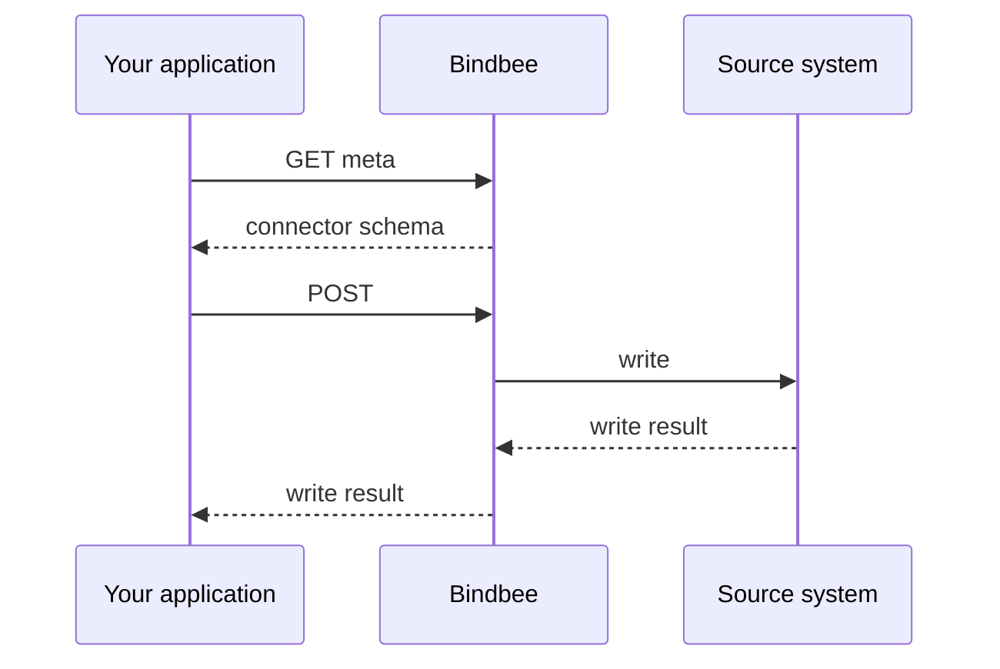

A write goes straight to the source system, and returns what that system said. That makes it asymmetric with reading.

## How a write works

**The request shape varies by connector.** What a system requires to create an employee differs by system, and by tenant within a system. You ask the connector for the schema first - see [Meta APIs](/guides/reading-writing/writing-data/meta-apis).

**Not every model accepts writes**, and support varies by integration - see [Model availability](/get-started/model-availability).

**Failures are business failures.** Insufficient leave balance, a closed payroll period, a mandatory custom field - the useful message is the source system's own.

**Your own write is not readable back straight away.** It lands in the source system, but reads still answer from the last completed sync - so it appears in a `GET` only once the next sync has picked it up. Force a resync if you need to confirm sooner - see [Syncing](/guides/reading-writing/syncing).

<Warning>
  A write that times out can still reach the provider. Retrying it blind can create a second record in your customer's system - see [Idempotency](/guides/reading-writing/writing-data/idempotency).
</Warning>

---

## Related

<CardGroup cols={2}>
  <Card title="Meta APIs" icon="code" href="/guides/reading-writing/writing-data/meta-apis">
    Fetch the exact request schema a connector expects before you write to it.
  </Card>

  <Card title="Create an employee" icon="user-plus" href="/get-started/use-cases/create-an-employee">
    A write worked end to end, from schema lookup to confirmation.
  </Card>

  <Card title="Idempotency" icon="repeat" href="/guides/reading-writing/writing-data/idempotency">
    Retry a failed write without creating a duplicate in the customer's HRIS.
  </Card>

  <Card title="Passthrough" icon="arrow-right-left" href="/guides/extending/passthrough">
    Reach an endpoint the unified write models do not cover.
  </Card>
</CardGroup>
