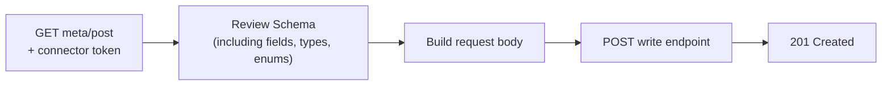

Write requirements differ across HRIS and payroll systems. One needs a pay statement type, another rejects a timesheet without hours, a third accepts fields Bindbee's unified model does not have.

A Meta endpoint returns the request body Bindbee expects for **one write operation on one connector**, in a JSON Schema compatible structure: field requirements, types, accepted values, formats, and nested objects.



<Info>
  Schemas resolve **per connector**. Two end users on different HRIS systems return different fields for the same operation.
</Info>

## Supported operations

| Operation | Meta endpoint | Write endpoint |
| --- | --- | --- |
| [Create Employee](/hris/employee/get-create-employee-meta) | `GET /api/hris/v1/employees/meta/post` | `POST /api/hris/v1/employees` |
| [Create Employee Payroll Run](/hris/employee-payroll-runs/get-create-employee-payroll-run-meta) | `GET /api/hris/v1/employee-payroll-runs/meta/post` | `POST /api/hris/v1/employee-payroll-runs` |
| [Create Timesheet](/hris/timesheet-entries/get-create-timesheet-meta) | `GET /api/hris/v1/timesheet-entry/meta/post` | `POST /api/hris/v1/timesheet-entry` |
| [Create Time Off Request](/hris/time-off/get-create-time-off-meta) | `GET /api/hris/v1/time-off/meta/post` | `POST /api/hris/v1/time-off` |

A write operation can be live for an integration before its Meta schema exists. See [501 Not Implemented](#errors).

## Calling a Meta endpoint

Every Meta call carries your API key and the end user's connector token - see [Authentication](/api-reference/basics/authentication).

```bash
curl --request GET \
  --url https://api.bindbee.dev/api/hris/v1/employees/meta/post \
  --header 'Authorization: Bearer <BINDBEE_API_KEY>' \
  --header 'X-Connector-Token: <CONNECTOR_TOKEN>'
```

Base URLs are `https://api.bindbee.dev` for the US and `https://api-eu.bindbee.dev` for the EU.

## Meta API response structure

A Meta API response defines the structure of the request body for the selected write operation. Alongside standard JSON Schema keywords, the response can include Bindbee-specific metadata such as `isRequired` and `enumInformation`.

These keywords appear most often:

| Keyword | Purpose |
| --- | --- |
| `type` | Defines the expected data type. |
| `properties` | Defines fields within an object. |
| `items` | Defines the structure of each element in an array. |
| `required` | Lists the fields required within an object. |
| `isRequired` | Indicates whether an individual field is required. |
| `description` | Provides a human-readable explanation of a field. |
| `format` | Defines an additional constraint for a string value. |
| `enum` | Lists the accepted values for a field. |
| `enumInformation` | Provides descriptions for values listed in `enum`. |

### Root object and field definitions

A top-level `type` of `object` indicates that the write request body must be a JSON object. The `properties` object contains the available fields, and the `required` array lists the fields the body must carry.

```json
{
  "type": "object",
  "properties": {
    "first_name": {
      "type": "string",
      "description": "The employee's first name.",
      "isRequired": true
    },
    "last_name": {
      "type": "string",
      "description": "The employee's last name.",
      "isRequired": true
    }
  },
  "required": ["first_name", "last_name"]
}
```

Use `isRequired` to review the requirement for an individual field. Use the `required` array to identify all mandatory fields within an object.

### Nested objects and arrays

For a field with `type: "object"`, `properties` defines the nested fields.

```json
"home_location": {
  "type": "object",
  "description": "The employee's home address.",
  "isRequired": false,
  "properties": {
    "street_1": {
      "type": "string",
      "description": "The first line of the street address.",
      "isRequired": false
    },
    "city": {
      "type": "string",
      "description": "The city of the address.",
      "isRequired": false
    }
  }
}
```

For a field with `type: "array"`, `items` defines the schema for each element.

```json
"earnings": {
  "type": "array",
  "description": "The earnings entries for the payroll run.",
  "isRequired": false,
  "items": {
    "type": "object",
    "properties": {
      "earning_code": {
        "type": "string",
        "isRequired": true
      },
      "amount": {
        "type": "number",
        "isRequired": false
      }
    },
    "required": ["earning_code"]
  }
}
```

## Integration-specific fields

Meta API responses can include `integration_params` and `additional_attributes`. These fields serve different purposes.

| Field | Structure | Validation | Purpose |
| --- | --- | --- | --- |
| `integration_params` | Defined object | Validated, and potentially required | Carries parameters the underlying integration needs for the write operation. |
| `additional_attributes` | Free-form object | Outside the unified schema | Carries integration-specific values Bindbee's unified fields do not hold. |

### `integration_params`

`integration_params` carries fields the underlying integration needs. The Meta API response defines its properties explicitly, and can mark them required.

```json
"integration_params": {
  "type": "object",
  "description": "Parameters required by the integration for the write operation.",
  "isRequired": true,
  "properties": {
    "pay_statement_type_id": {
      "type": "string",
      "isRequired": true
    }
  },
  "required": ["pay_statement_type_id"]
}
```

### `additional_attributes`

`additional_attributes` is a free-form object for fields the underlying integration supports but Bindbee's unified model does not carry.

```json
"additional_attributes": {
  "type": "object",
  "description": "Additional integration-specific attributes for the write operation.",
  "isRequired": false
}
```

Bindbee forwards whatever you put in `additional_attributes` to the underlying integration as part of the write request.

## Accepted values and validation

Two pairs of keywords constrain what a field will accept: `enum` with `enumInformation`, and `description` with `format`.

### `enum` and `enumInformation`

The `enum` keyword lists the values a field accepts. Where available, `enumInformation` describes each one.

```json
"pay_statement_type_id": {
  "type": "string",
  "isRequired": true,
  "enum": ["51743768", "51743769", "51743758"],
  "enumInformation": [
    {
      "value": "51743768",
      "description": "Third-Party Sick"
    },
    {
      "value": "51743769",
      "description": "Bonus"
    },
    {
      "value": "51743758",
      "description": "Regular"
    }
  ]
}
```

The request body must use one of the values `enum` lists. Read the matching entry in `enumInformation` to work out which one you want.

### `description` and `format`

The `description` keyword explains what a field is for. The `format` keyword adds a constraint on a string value, such as an email address or a UUID.

```json
"work_email": {
  "type": "string",
  "description": "The employee's work email address.",
  "format": "email",
  "isRequired": false
}
```

## Constructing the write request

Once you have read the schema, build a request body that carries every required field and matches the types, formats, and accepted values it defines.

For example, if `first_name` and `last_name` are required, the following request body is valid:

```json
{
  "first_name": "Jane",
  "last_name": "Doe",
  "work_email": "jane@acme.com",
  "additional_attributes": {
    "employee_number": "E-1042"
  }
}
```

In this example:

- `first_name` and `last_name` satisfy the required field definitions.
- `work_email` conforms to the `email` format.
- `employee_number` rides along as an integration-specific attribute.

## Best practices

- **Fetch per connector**: Not per organization. Requirements differ by end user system.
- **Refresh the schema**: Enum values such as pay statement types and time off policies change upstream.
- **Drive your UI from it**: Render forms from `properties`, `required`, and `enumInformation`.
- **Validate before sending**: Catching a missing field locally saves a `422` round trip.

## Errors

| Status | Meaning | Fix |
| --- | --- | --- |
| `401` | API key missing or invalid. | Check the `Authorization` header, regenerate the key in Settings. |
| `403` | Valid credentials, no access. Wrong API category for the token, or writes disabled on the model. | Confirm the connector supports the operation and writes are enabled. |
| `422` | Validation failed. | Diff the body against the schema, starting with `required` and `enum`. |
| `429` | Rate limit exceeded. | Retry after `Retry-After`. See [Rate Limits](/api-reference/basics/rate-limits). |
| `501` | No Meta schema for this integration and operation. | See below. |

<Accordion title="501 Not Implemented" icon="triangle-alert">
  ```json
  {
    "detail": "Meta API is not implemented for Time Off in bamboohr. You can request this feature by contacting support@bindbee.dev."
  }
  ```

  The write operation may still be supported. Check the write endpoint page for that integration, which lists provider specific payload requirements. To request Meta support for another integration or operation, email [support@bindbee.dev](mailto:support@bindbee.dev).
</Accordion>

## Related

<CardGroup cols={2}>
  <Card title="Authentication" icon="key" href="/api-reference/basics/authentication">
    The API key and connector token every Meta call needs.
  </Card>

  <Card title="Create Employee" icon="user-plus" href="/hris/employee/create-employee">
    API reference for the write endpoint the schema describes.
  </Card>

  <Card title="Custom fields" icon="sliders-horizontal" href="/guides/extending/custom-fields">
    Add values the unified model does not carry.
  </Card>

  <Card title="Create an employee" icon="rocket" href="/get-started/use-cases/create-an-employee">
    A worked write, from the Meta call to the created record.
  </Card>
</CardGroup>
