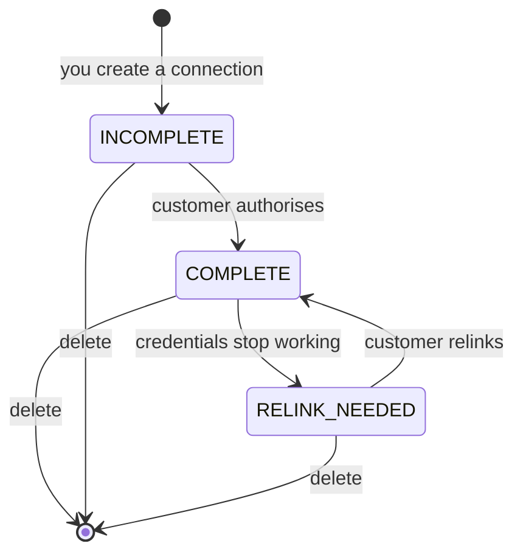

{/* CONTENT PASS: merged from how-to/reliability/detect-a-connection-that-needs-relinking, how-to/connections/update-credentials. Connector states brought across from connector-lifecycle; RELINK_NEEDED is now explained in both the Steps and the states section - keep one. */}


Source-system credentials expire, get rotated, or lose permissions. When that happens the connector stops syncing, and unless you're listening, your pipeline keeps reading the last successful sync and silently serves stale data.

<Info>
  **Before you start**

  - You have an HTTPS endpoint that can receive `POST` requests and respond within 10 seconds.
  - You can map an incoming `connector.id` back to the customer in your own system.
</Info>

## Steps

<Steps>
  <Step title="Subscribe to the sync error event">
    Create a webhook for the environment you're operating in and select **Sync error**. See [Create a Webhook](/guides/reading-writing/webhooks).

    **Result:** Your endpoint receives a `connector_sync_error` payload whenever a sync fails.
  </Step>

  <Step title="Read the connector status from the payload">
    Each payload carries a `connector` object identifying the connection, and an `error` object describing the failure.

    ```json
    {
      "webhook": { "event": "connector_sync_error" },
      "connector": {
        "id": "019ebc1c-953a-7ba9-b599-0e6599e30304",
        "display_name": "Workday",
        "integration_slug": "workday",
        "origin_id": "your_internal_customer_id",
        "connector_status": "COMPLETE",
        "end_user_name": "Coca Cola"
      },
      "data": { "display_status": "Failed" },
      "error": {
        "failed_at": "2026-07-07T11:21:35.837448+00:00",
        "message": "A runtime error occurred during the sync process.",
        "detail": {}
      },
      "sync": { "sync_id": "019f3c4f-...", "sync_type": "AUTOMATED", "sync_name": "#6" }
    }
    ```

    Branch on `connector.connector_status`. It carries one of three values:

    | Value | Meaning |
    | --- | --- |
    | `COMPLETE` | Authorised and syncing |
    | `INCOMPLETE` | The end user never finished authorising |
    | `RELINK_NEEDED` | Credentials stopped working - the end user must reconnect |

    Only `RELINK_NEEDED` means the end user must act. Any other failure is transient or data-level and retries on the next scheduled sync.

    <Note>
      Relinking preserves the `connector_token`, so a connector recovering from
      `RELINK_NEEDED` needs no change to anything you've stored - see
      [How connections work](/get-started/how-to-connect).
    </Note>

    **Result:** You can tell "this user must act" from "this will fix itself".
  </Step>

  <Step title="Route the connection to your own re-auth flow">
    Use `connector.origin_id` to resolve the connection back to your customer record. Mark the connection as degraded in your system so downstream jobs skip it, then prompt the customer to reconnect.

    To generate a fresh connection link, see [Update credentials](/guides/troubleshooting/connections-to-relink).

    **Result:** The affected customer is notified and your pipeline stops treating their data as current.
  </Step>

  <Step title="Detect syncs that never start">
    A failed sync fires an event. A sync that simply doesn't run does not.

    Subscribe to **Sync start** as well, record the `sync.sync_id` and timestamp per connector, and alert when the gap since the last start exceeds the connector's configured cadence plus a margin. When you need data sooner than the next scheduled run, call [Force a resync](/api-reference/connectors/resync-connector).

    **Result:** Silent stalls surface as alerts rather than as stale reads.
  </Step>
</Steps>

## What this leaves open

Three gaps are now covered: a failed sync, an expired credential, and a sync that never started. The one still open is reading data mid-sync - for that, gate your job on `connector_synced` rather than on a clock. See [Trigger a job on completion](/guides/reading-writing/syncing).

## If this didn't work

<AccordionGroup>
  <Accordion title="No events arrive at all">
    Webhooks are environment-specific. A Production webhook receives nothing for Development connectors, and the reverse. Confirm the webhook type matches the connector's environment.
  </Accordion>

  <Accordion title="Events arrive intermittently">
    Almost always slow acknowledgement. Every non-`2xx` and every network-layer failure counts against a short retry budget - see [Delivery and retries](/guides/reading-writing/webhooks#delivery-and-retries) for the exact window and timeout.

    If your handler does work before responding, it will exceed the timeout under load. Acknowledge with `200` immediately and process asynchronously. Deliveries that exhaust all retries are not redelivered later.
  </Accordion>

  <Accordion title="You're on a cron schedule and don't want to move to webhooks">
    You don't have to move your processing. Subscribe to sync error alone, purely as a signal to skip or defer that customer's run - your cron keeps its schedule, and this stops it from processing a connection that hasn't updated.
  </Accordion>

  <Accordion title="The error message is generic">
    `error.message` can be a summary, with `detail` returned as an empty object when nothing more specific is available. Use the connector's sync history for the per-model breakdown - see [Partial syncs](/guides/troubleshooting/partial-syncs).
  </Accordion>
</AccordionGroup>

## Re-authorising a connector

When credentials rotate, expire, or lose access, the connector stops syncing and its `status` becomes `RELINK_NEEDED`. Relink it rather than creating a new one - relinking keeps the connector ID and its record history, so the IDs your system has stored stay valid.

<Warning>
  Do not delete the connector and issue a fresh Magic Link. That creates a new connector with new record identities, and every Bindbee ID you have stored for that customer breaks.
</Warning>

<Info>
  **Before you start**

  - You've confirmed the failure is credential-related, not a permission gap - see [Permission errors](/guides/troubleshooting/permission-errors).
  - You can reach the customer's HRIS administrator.
</Info>

### Steps

<Steps>
  <Step title="Open the connector">
    Find it under **Connectors** and open its page - see [Connectors](/get-started/platform).

    **Result:** You can see its current status and sync history.
  </Step>

  <Step title="Generate a relink">
    Click **Relink Connector**. This produces an updated Magic Link for the same connector.

    **Result:** A link the customer can open to re-enter credentials, updating the existing connector rather than creating another.
  </Step>

  <Step title="Send it to the administrator">
    Forward the link to whoever administers their HRIS, with the relevant guide from [help.bindbee.dev](https://help.bindbee.dev).

    If the credentials changed because a token, certificate, or integration user was rotated on their side, they need the new values ready before opening the link.

    **Result:** The customer has what they need to reconnect.
  </Step>

  <Step title="Resync and verify">
    Once they've reconnected, trigger a sync rather than waiting for the next scheduled run - see [Force a resync](/guides/reading-writing/syncing).

    Then check the run completed in the connector's sync history.

    <Note>
      The `connector_token` does not change. Relinking updates the credentials
      behind the connector, not the connector itself, so everything your system
      has stored stays valid. If you need the value anyway, it's in the
      connector's **Connector Details** panel, masked behind a reveal control
      with a copy button.
    </Note>

    **Result:** The connector is syncing again and the data is current.
  </Step>
</Steps>

### Preventing the silent version of this

The failure mode that costs the most is not the relink - it's the days before anyone notices. A connector in `RELINK_NEEDED` stops updating, but reads keep returning the last successful sync, so downstream systems process stale data as if it were current. Nothing on the data endpoints errors - see [How connections work](/get-started/how-to-connect) for why the data is kept rather than withheld.

Subscribe to sync error events so this surfaces immediately. See [Connections needing relink](/guides/troubleshooting/connections-to-relink).

### If this didn't work

<AccordionGroup>
  <Accordion title="The relink completes but the sync fails the same way">
    The credentials are valid but lack the access the sync needs. That's a permission problem wearing an authentication costume - see [Permission errors](/guides/troubleshooting/permission-errors).
  </Accordion>

  <Accordion title="The customer can't complete the relink screen">
    Some integrations need values generated in the source system first - an API token, a certificate and private key, or a reactivated integration user. The per-system guide lists the prerequisites.

    Where the source system restricts API access by IP as well as by credentials, correct credentials still fail. Ask support for current egress ranges.
  </Accordion>

  <Accordion title="You can't reach the customer and the connection is blocking your pipeline">
    Mark the connection degraded in your own system so downstream jobs skip it rather than consuming stale data. The connector keeps its last synced state and resumes on the next successful sync after relinking.
  </Accordion>

  <Accordion title="Credentials keep expiring on the same connector">
    Recurring expiry usually means the source system was connected with a personal account subject to password rotation or offboarding, rather than a dedicated integration user. Raise it with the administrator - a service account fixes it permanently.
  </Accordion>
</AccordionGroup>

## Connector states

### The states



**Relinking is the only edge that returns a connector to health, and deletion is the only one that cannot be walked back.**

**Pending (`INCOMPLETE`).** Created when you initiate a connection, before your customer has authorised it. No credentials, no data, no syncs.

**Active (`COMPLETE`).** Authorised and syncing on schedule. The normal steady state.

**Broken (`RELINK_NEEDED`).** Credentials that no longer work - an expired OAuth token, a rotated API key, a deactivated integration user, narrowed permissions. All behave identically from your side.

A broken connector keeps the data it already synced - it just stops acquiring more, and what you hold goes stale in place. `relink_needed_at` records when the credentials were deemed invalid, so you can measure how long.

### Two fields, two questions

`status` is not the whole picture. A connector carries a second, independent field, and **a healthy `status` does not mean data is arriving.**

| Field | Values | Answers | The bad value |
| --- | --- | --- | --- |
| `status` | `INCOMPLETE`, `COMPLETE`, `RELINK_NEEDED` | Are the credentials good? | `RELINK_NEEDED` - only your customer can fix it |
| `sync_status` | `Syncing`, `Done`, `Failed` | Did the last run succeed? | `Failed` - usually permissions or an upstream outage |

A connector sitting at `COMPLETE` with `sync_status: Failed` has working credentials and is still not updating. That is a different problem with a different fix, and monitoring only `status` misses it entirely.

<Warning>
There is no error on the data endpoints in either case. Your application keeps reading successfully from a connector that stopped syncing weeks ago. **These two fields and the sync-status webhooks are the only reliable signals.**
</Warning>

{/* VERIFY: what does is_active mean, and how does it relate to status? The spec describes it only as "Flag to indicate if connector is active or not". If it can be false while status is COMPLETE, it is a third signal this page should cover. */}

### Relinking versus deleting

When a connector breaks, both actions available to you look like they mean "fix it". They do not.

**Relinking** sends your customer back through authorisation. The connector keeps its identity, history, records and `connector_token`, so nothing you stored needs updating. Data reconciles and syncing resumes.

This is the correct response to essentially every broken connector.

**Deleting** removes the connector *and its data* - identifiers, records, sync history. Recovery means a new connector and a fresh initial sync, and **every record returns with a new Bindbee `id`**, breaking any foreign key you stored.

Deletion is right when a customer churns or a connection was created in error, and it is your data-removal mechanism. But the same operation that satisfies a removal request destroys a recoverable integration - so it is the wrong reflex for a broken one.

<Note>
Because relinking preserves the token, a `connector_token` that stops working after a customer "reconnects" is worth investigating rather than refetching. Only deletion and re-creation replace it.
</Note>

### Credential rotation is routine

Customers rotate API keys, cycle service accounts, and offboard the administrator who originally authorised the connection. Each breaks a connector through nobody's fault.

The last one deserves planning. **When authorisation is tied to an individual's account rather than a dedicated integration user, that person leaving takes the connection with them** - a common cause of a connector breaking months after a clean setup, found late because nothing announces it.

## Related

- [How to connect](/get-started/how-to-connect) - how a connector is created in the first place
- [Sync Status](/guides/troubleshooting/sync-status) - the other half of connector health
- [Errors & Issues](/guides/troubleshooting/errors-and-issues) - where failures surface
