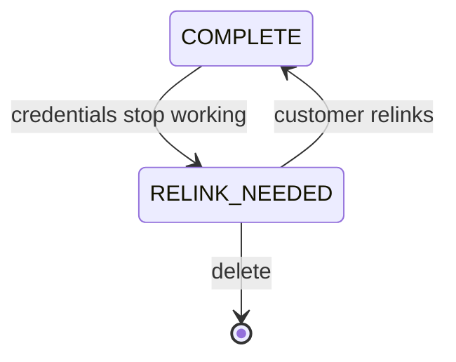

Source-system credentials expire, get rotated, or lose access. The connector moves to `RELINK_NEEDED` and stops syncing.

Reads keep returning the last successful sync, so downstream systems treat stale data as current. The data endpoints answer `200` throughout.

<Warning>
  Relink the existing connector. Deleting it and starting fresh breaks every Bindbee ID you
  have stored - see [Relinking versus deleting](#relinking-versus-deleting).
</Warning>

<Info>
  **Before you start**

  - You've confirmed the failure is credential-related, rather than a permission gap - see [Origin-system errors](/guides/troubleshooting/errors#origin-system-errors).
  - You can reach the customer's HRIS administrator.
</Info>

## Steps

<Steps>
  <Step title="Open the connector">
    Locate it under **Connectors**. The **Relink Needed** counter above the list totals every connection in this state.

    **Result:** You can see its current status and sync history.

  </Step>

  <Step title="Generate a relink">
    A connector needing re-authorization carries a **Relink Needed** banner with the date it entered that state, and **Force Sync** is disabled. Click **Relink Connector** to produce an updated Magic Link for the same connector.

    **Result:** A link ready to send to the customer.

    <Frame>
      
    </Frame>
  </Step>

  <Step title="Send it to the administrator">
    Forward the link to whoever administers their HRIS, with the relevant guide from [help.bindbee.dev](https://help.bindbee.dev).

    Where a token, certificate, or integration user was rotated on their side, they need the new values ready before opening the link.

    **Result:** The customer has what they need to reconnect.
  </Step>

  <Step title="Resync and verify">
    Once they've reconnected, trigger a sync rather than waiting for the next scheduled run. Then check the run completed in the connector's sync history.

    **Result:** The connector is syncing again and the data is current.

    <Note>
      The `connector_token` survives a relink. Relinking updates the credentials behind the
      connector rather than the connector itself.
    </Note>
  </Step>
</Steps>

## Relinking versus deleting

A connector in `RELINK_NEEDED` has two exits.

**Relinking** keeps the connector's identity, history, records and `connector_token`, and syncing resumes where it left off. This is the right response to a broken connector.

**Deleting** removes the connector *and its data* - identifiers, records, sync history. Recovery means a new connector and a fresh initial sync. Every record comes back with a new Bindbee `id`, breaking any foreign key you stored.

Deletion earns its place when a customer churns or a connection was created in error - see [Data deletion](/guides/workspace/data-deletion).

## Catch it earlier

The expensive part is the days before anyone notices. Subscribe to `connector_sync_error` and a stalled connector reaches you the day it breaks - see [Monitoring this programmatically](/guides/troubleshooting/sync-status#monitoring-this-programmatically).

Branch on `connector.connector_status` in the payload. `RELINK_NEEDED` is the one value that means your customer must act. The rest retry on the next scheduled sync.

<Note>
  A connector can sit at `COMPLETE` with its last sync `Failed`. Credentials are fine and data
  still isn't arriving, which is a different problem - see [Sync status](/guides/troubleshooting/sync-status).
</Note>

## Frequently Asked Questions

<AccordionGroup>
  <Accordion title="The relink completes but the sync fails the same way">
    The credentials are valid and lack the access the sync needs - see [Origin-system errors](/guides/troubleshooting/errors#origin-system-errors).
  </Accordion>

  <Accordion title="You can't reach the customer and the connection is blocking your pipeline">
    Mark the connection degraded in your own system so downstream jobs skip it rather than consuming stale data. The connector keeps its last synced state.
  </Accordion>

  <Accordion title="Credentials keep expiring on the same connector">
    Recurring expiry points at a personal account subject to password rotation or offboarding, where a dedicated integration user belongs. A service account fixes it permanently.
  </Accordion>
</AccordionGroup>

## Related

- [Sync status](/guides/troubleshooting/sync-status) - the first check, and where sync alerting is set up
- [Errors](/guides/troubleshooting/errors) - when credentials work and a model still fails
- [How connections work](/get-started/how-to-connect) - how a connector is created
- [Record identity](/guides/reading-writing/record-identity) - why a delete-and-recreate changes every stored `id`
