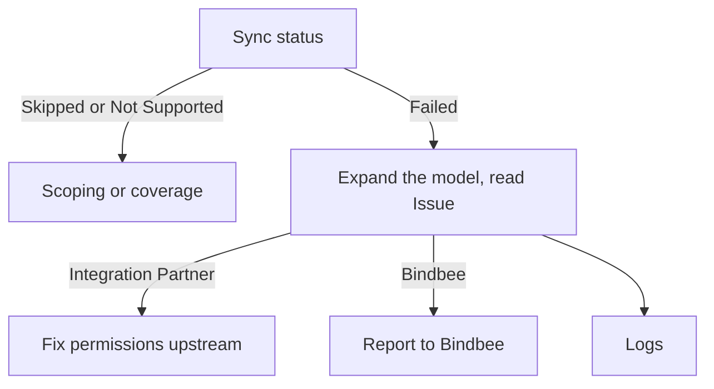

Start at the connector's sync status. It answers most questions outright.

## The debugging flow

1. [Sync status](/guides/troubleshooting/sync-status) - `Skipped` and `Not Supported` end here. A `Failed` model expands to name its **Issue**.
2. [Errors](/guides/troubleshooting/errors) - `Integration Partner` sends you to the customer's administrator. `Bindbee` is ours to fix.
3. [Logs](/guides/troubleshooting/logs) - the request-level record, for gaps the first two leave open.

<Note>
  Subscribe to the **Connector Sync Error** webhook event (`connector_sync_error`) and a
  failed sync reaches you before the customer notices - see
  [Monitoring this programmatically](/guides/troubleshooting/sync-status#monitoring-this-programmatically).
</Note>

## Related

- [Connector relink](/guides/troubleshooting/connector-relink) - when reads return stale data and the connector shows `RELINK_NEEDED`
- [Missing records](/guides/troubleshooting/missing-records) - when a record the customer can see is absent from Bindbee
- [Duplicate records](/guides/troubleshooting/duplicate-records) - when one person appears twice
- [Record counts](/guides/troubleshooting/record-counts) - when your count and the customer's don't match
- [Scope & permissions](/get-started/scoping) - why data goes missing while every call succeeds
- [Webhooks](/guides/reading-writing/webhooks) - the event catalog behind sync alerting
