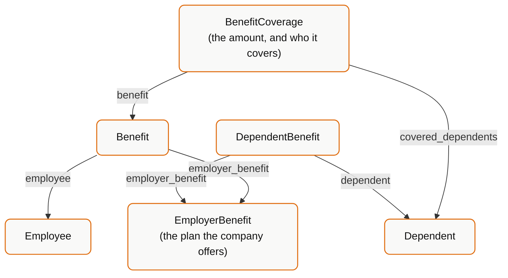
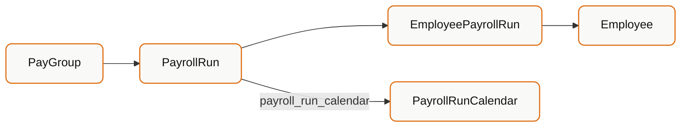

Employee data is one model. Benefits and payroll are a **graph**, and getting the graph wrong is the most common cause of "the numbers don't match" tickets.

**You will build:** an employee's benefits enrolment view, and their payroll history.

<Info>
  If you only read one thing first, read
  [Benefits vs Employer Benefits vs Dependent Benefits](/explanation/benefits-models).
  This tutorial assumes it.
</Info>

---

## Part 1 - Benefits

### The shape of the graph



In words:

| Model | One row per | Answers |
| --- | --- | --- |
| `EmployerBenefit` | Plan the employer offers | "What plans exist?" |
| `Benefit` | Employee enrolled in a plan | "What is *this employee* on, and what do they pay?" |
| `Dependent` | Person attached to an employee | "Who is the spouse/child?" |
| `DependentBenefit` | Dependent enrolled in a plan | "Which plan is the dependent on?" |
| `BenefitCoverage` | Coverage amount on an enrolment | "How much cover, and who does it apply to?" |

<Warning>
  `DependentBenefit` links a dependent to an **`employer_benefit`** - the plan -
  not to the employee's `Benefit` row. Do not assume you can walk from a
  dependent's benefit directly to the employee's benefit record.
</Warning>

### Step 1 - Fetch the employee's enrolments

```bash
curl -G "https://api.bindbee.dev/api/hris/v1/benefits" \
  -H "Authorization: Bearer $BINDBEE_API_KEY" \
  -H "X-Connector-Token: $CONNECTOR_TOKEN" \
  --data-urlencode "expand=employer_benefit"
```

```json
{
  "id": "0192aa11-3f21-7c40-9e11-6b2d4c8f1a03",
  "employee": "01931edf-04b6-7391-8a5c-93ac4b395316",
  "plan_name": "Acme PPO Medical",
  "provider_name": "Blue Shield",
  "benefit_plan_type": "MEDICAL",
  "benefit_plan_category": "HEALTH",
  "coverage_tier": "EMPLOYEE_AND_SPOUSE",
  "employee_contribution": 142.50,
  "company_contribution": 517.00,
  "frequency": "MONTHLY",
  "start_date": "2026-01-01",
  "effective_date": "2026-01-01",
  "end_date": null,
  "employer_benefit": "0192aa10-1c07-7b2e-8f00-5a1b3d7e9c42"
}
```

Read the contribution fields carefully:

| Field | Whose money | Cadence |
| --- | --- | --- |
| `employee_contribution` | Deducted from the employee | Per `frequency` |
| `company_contribution` | Paid by the employer | Per `frequency` |

<Warning>
  `frequency` is **not** always monthly. A plan on `BIWEEKLY` frequency with a
  `employee_contribution` of `142.50` costs the employee ~`$3,705` a year, not
  `$1,710`. Always normalize by `frequency` before comparing plans or computing
  annual cost.
</Warning>

`end_date: null` means the enrolment is currently open. A non-null `end_date` in the past means it has lapsed - filter these out when showing "current coverage".

### Step 2 - Fetch the plan catalogue

`EmployerBenefit` describes the plan itself, independent of anyone's enrolment:

```bash
curl "https://api.bindbee.dev/api/hris/v1/employer-benefits" \
  -H "Authorization: Bearer $BINDBEE_API_KEY" \
  -H "X-Connector-Token: $CONNECTOR_TOKEN"
```

```json
{
  "id": "0192aa10-1c07-7b2e-8f00-5a1b3d7e9c42",
  "plan_name": "Acme PPO Medical",
  "provider_name": "Blue Shield",
  "benefit_plan_type": "MEDICAL",
  "benefit_plan_category": "HEALTH",
  "deduction_code": "MED-PPO",
  "description": "PPO medical plan, national network",
  "coverage_tiers": ["EMPLOYEE_ONLY", "EMPLOYEE_AND_SPOUSE", "FAMILY"],
  "start_date": "2026-01-01",
  "end_date": null
}
```

Note the plural: `EmployerBenefit.coverage_tiers` is the list of tiers the plan *offers*. `Benefit.coverage_tier` is the single tier the employee actually *chose*.

`deduction_code` is the payroll code - this is your join key when reconciling a benefit against a payroll deduction line.

### Step 3 - Fetch dependents and their enrolments

```bash
curl -G "https://api.bindbee.dev/api/hris/v1/dependents" \
  -H "Authorization: Bearer $BINDBEE_API_KEY" \
  -H "X-Connector-Token: $CONNECTOR_TOKEN" \
  --data-urlencode "expand=employee"

curl "https://api.bindbee.dev/api/hris/v1/dependent-benefits" \
  -H "Authorization: Bearer $BINDBEE_API_KEY" \
  -H "X-Connector-Token: $CONNECTOR_TOKEN"
```

`Dependent` carries `relationship`, `date_of_birth`, `is_student`, `gender`, `ssn` and an address - the fields eligibility rules are usually written against.

`DependentBenefit` is thin by design: `dependent`, `employer_benefit`, and the date range.

### Step 4 - Fetch coverage amounts

`BenefitCoverage` attaches a monetary amount to an enrolment and records who it covers:

```json
{
  "id": "0192aa12-7d44-7e10-b3a0-9c6f2e5b8d71",
  "benefit": "0192aa11-3f21-7c40-9e11-6b2d4c8f1a03",
  "currency": "USD",
  "amount": 50000.00,
  "is_employee_covered": true,
  "covered_dependents": ["0192aa13-0e55-7f21-a4b1-7d8e3f6c9a02"]
}
```

This is the model to use for life and disability plans where "how much cover" is the question. Not every connector populates it - see [Integrations & Coverage](/integrations).

### Step 5 - Assemble the view

```python
from collections import defaultdict

employee_id = "01931edf-04b6-7391-8a5c-93ac4b395316"

plans      = {p["id"]: p for p in fetch_all("/api/hris/v1/employer-benefits")}
benefits   = [b for b in fetch_all("/api/hris/v1/benefits")
              if b["employee"] == employee_id and b["end_date"] is None]
dependents = {d["id"]: d for d in fetch_all("/api/hris/v1/dependents")
              if d["employee"] == employee_id}

dep_enrolments = defaultdict(list)
for db in fetch_all("/api/hris/v1/dependent-benefits"):
    if db["dependent"] in dependents and db["end_date"] is None:
        dep_enrolments[db["employer_benefit"]].append(dependents[db["dependent"]])

coverage_by_benefit = {c["benefit"]: c
                       for c in fetch_all("/api/hris/v1/benefit-coverages")}

PER_YEAR = {"WEEKLY": 52, "BIWEEKLY": 26, "SEMIMONTHLY": 24,
            "MONTHLY": 12, "QUARTERLY": 4, "ANNUALLY": 1}

for benefit in benefits:
    plan     = plans.get(benefit["employer_benefit"], {})
    coverage = coverage_by_benefit.get(benefit["id"])
    periods  = PER_YEAR.get(benefit.get("frequency"))

    print({
        "plan":            benefit["plan_name"],
        "type":            benefit["benefit_plan_type"],
        "tier":            benefit["coverage_tier"],
        "deduction_code":  plan.get("deduction_code"),
        "annual_employee_cost": (
            benefit["employee_contribution"] * periods
            if periods and benefit.get("employee_contribution") is not None
            else None      # unknown frequency - do not guess
        ),
        "covered_dependents": [
            d["first_name"] for d in dep_enrolments[benefit["employer_benefit"]]
        ],
        "coverage_amount": coverage["amount"] if coverage else None,
    })
```

<Tip>
  Return `None` rather than a guess when `frequency` is missing or unrecognised.
  A silently wrong annual cost is worse than a visibly absent one.
</Tip>

---

## Part 2 - Payroll

### The shape



| Model | One row per | Answers |
| --- | --- | --- |
| `PayGroup` | Payroll population | "Who is paid on the same cycle?" |
| `PayrollRunCalendar` | Pay schedule | "When are the pay periods?" |
| `PayrollRun` | Company-wide payroll execution | "Did the March 15 run complete?" |
| `EmployeePayrollRun` | One employee in one run | "What did Jane earn and get deducted?" |
| `Compensation` | Employee's pay rate | "What is Jane's salary?" |

<Note>
  `Compensation` is the *rate* - what the employee is contracted to earn.
  `EmployeePayrollRun` is the *actual* - what was paid in a specific period.
  They will not match, and are not supposed to.
</Note>

### Step 6 - Read payroll runs

```bash
curl -G "https://api.bindbee.dev/api/hris/v1/payroll-runs" \
  -H "Authorization: Bearer $BINDBEE_API_KEY" \
  -H "X-Connector-Token: $CONNECTOR_TOKEN" \
  --data-urlencode "expand=pay_group"
```

```json
{
  "id": "0192bb01-4a10-7c33-9d21-1f4b6e8a3c50",
  "pay_group": "0192bb00-2e01-7a12-8b40-0d3a5c7f2b91",
  "run_state": "PAID",
  "run_type": "REGULAR",
  "start_date": "2026-03-01",
  "end_date": "2026-03-15",
  "check_date": "2026-03-20",
  "payroll_run_calendar": "0192bb02-6c22-7d44-af51-2b5c7d9e4f13"
}
```

`check_date` - not `end_date` - is when money actually moved. Use it for cash-flow and reconciliation logic.

`run_type` distinguishes `REGULAR` from off-cycle runs (bonuses, corrections). Including off-cycle runs in a "typical monthly pay" calculation is a classic source of inflated averages.

### Step 7 - Read an employee's pay detail

```bash
curl -G "https://api.bindbee.dev/api/hris/v1/employee-payroll-runs" \
  -H "Authorization: Bearer $BINDBEE_API_KEY" \
  -H "X-Connector-Token: $CONNECTOR_TOKEN" \
  --data-urlencode "expand=employee,payroll_run"
```

```json
{
  "id": "0192bb03-8f33-7e55-b062-3c6d8e0f5a24",
  "employee": "01931edf-04b6-7391-8a5c-93ac4b395316",
  "payroll_run": "0192bb01-4a10-7c33-9d21-1f4b6e8a3c50",
  "gross_pay": 6250.00,
  "net_pay": 4102.37,
  "start_date": "2026-03-01",
  "end_date": "2026-03-15",
  "check_date": "2026-03-20",
  "earnings": [ ... ],
  "deductions": [ ... ],
  "taxes": [ ... ]
}
```

`earnings`, `deductions` and `taxes` are line-item arrays. `gross_pay` minus `net_pay` will not equal the sum of `deductions` alone - taxes are a separate array.

### Step 8 - Reconcile benefits against payroll

This is the join most benefits products need:

```python
# EmployerBenefit.deduction_code ⟷ deduction line code on EmployeePayrollRun
codes = {p["deduction_code"]: p
         for p in fetch_all("/api/hris/v1/employer-benefits")
         if p.get("deduction_code")}

for epr in fetch_all("/api/hris/v1/employee-payroll-runs"):
    for line in epr.get("deductions") or []:
        plan = codes.get(line.get("name") or line.get("code"))
        if plan:
            print(epr["check_date"], plan["plan_name"], line)
```

<Warning>
  `deduction_code` is populated by the source system and is not guaranteed to be
  present or unique on every connector. Treat a failed match as "unknown", not
  as "zero".
</Warning>

---

## Troubleshooting

| Symptom | Likely cause |
| --- | --- |
| `benefits` empty but the HRIS shows plans | Benefits are a separate permission scope in many systems - the connection may not have been granted it |
| `company_contribution` is `null` | Many systems only expose the employee side |
| Dependents present, `dependent-benefits` empty | The system tracks dependents without per-plan enrolment records |
| `benefit-coverages` empty | Not supported by that connector - see [Integrations & Coverage](/integrations) |
| Annual cost looks 2x wrong | `frequency` mishandled - see Step 1 |

For anything the unified model does not carry, check `include_raw_data=true` first, then reach for a [custom field](/how-to/map-custom-fields) or [passthrough](/how-to/use-passthrough).

## Next

<CardGroup cols={2}>
  <Card title="Benefits Models Explained" icon="list-tree" href="/explanation/benefits-models">
    The full conceptual treatment of the benefits graph.
  </Card>
  <Card title="Write Data Back" icon="square-pen" href="/how-to/write-data-back">
    Push time off, timesheets and payroll data into the source system.
  </Card>
</CardGroup>
