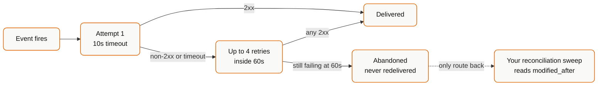

Bindbee retries a failed delivery up to 4 times within 60 seconds, with a 10-second timeout per attempt. After that the delivery is abandoned and **not** redelivered later.



An outage longer than a minute means permanently lost events. Recovery is a read, not a replay.

<Info>
  **Before you start**

  - You know roughly when your endpoint was unavailable.
</Info>

## Steps

<Steps>
  <Step title="Establish the outage window">
    Take the earliest plausible start and the latest plausible end. Overlapping is free; a gap is not.

    **Result:** A time range to recover.
  </Step>

  <Step title="Reconcile with an incremental read">
    Rather than recovering events, read the current state of anything that changed during the window.

    ```bash
    curl --request GET \
      --url 'https://api.bindbee.dev/api/hris/v1/employees?modified_after=2026-08-14T02:00:00Z&page_size=200' \
      --header 'Authorization: Bearer <BINDBEE_API_KEY>' \
      --header 'X-Connector-Token: <CONNECTOR_TOKEN>'
    ```

    Set `modified_after` to the start of the outage. See [Filter with modified_after](/how-to/reading-data/filter-with-modified-after).

    Current state is generally better than the lost events anyway - if a record changed three times during the outage, you want where it ended up.

    **Result:** Everything that changed, regardless of which events were lost.
  </Step>

  <Step title="Repeat per affected connector and model">
    Webhooks span every connector in the environment, so an outage affects all of them. `modified_after` is per model, so a change to an employment doesn't mark its employee as synced.

    Reconcile each model your integration consumes, for each connector.

    **Result:** No model silently left behind.
  </Step>

  <Step title="Check for stalled connectors">
    A missed sync-error event means a connection may have broken during the outage and gone unnoticed. Since that produces *no* new data, an incremental read won't surface it.

    Check sync status per connector - see [Monitor Sync Status](/how-to/troubleshooting/monitor-sync-status).

    **Result:** Silent stalls caught rather than inherited.
  </Step>
</Steps>

## Building so this costs less next time

**Acknowledge before processing.** Return `200` as soon as the payload is stored, then work asynchronously. Most delivery loss is a slow handler exceeding the 10-second timeout, not an outage.

**Store the raw payload.** Persisting deliveries on arrival, before any processing, turns a processing bug into a replay rather than a reconciliation.

**Track a watermark per connector.** A stored last-processed timestamp makes recovery a parameter change instead of an investigation.

**Alert on silence.** No events for a connector past its expected cadence is a signal in itself - see [Detect a Connection That Needs Relinking](/how-to/reliability/detect-a-connection-that-needs-relinking).

## If this didn't work

<AccordionGroup>
  <Accordion title="You don't know when the outage started">
    Reconcile from your last confidently-processed timestamp. Over-reading is safe if your processing is idempotent, which it should be - resyncs already cause reprocessing in normal operation.
  </Accordion>

  <Accordion title="Deliveries are being lost without an outage">
    Slow acknowledgement. Every non-2xx and every timeout consumes a retry, and four failures inside 60 seconds exhausts them. Measure your handler's response time under load rather than at rest.
  </Accordion>

  <Accordion title="Signature verification was failing during the window">
    Failed verification returns a non-2xx, which consumes retries exactly like an outage - a regenerated signature key deployed out of order produces this. Recover the same way, and see [Validate Webhook Signatures](/how-to/reliability/validate-webhook-signatures).
  </Accordion>

  <Accordion title="You need the events themselves, not current state">
    Not available - there's no delivery replay. Design around current-state reconciliation, and store raw payloads on arrival if your workflow genuinely needs the event history.
  </Accordion>
</AccordionGroup>

## Related

- [Webhooks](/webhooks/overview)
- [Filter with modified_after](/how-to/reading-data/filter-with-modified-after)
