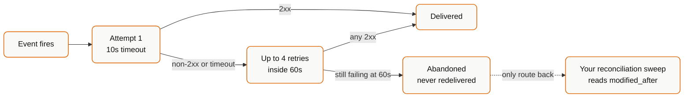

Your endpoint is publicly reachable, so anyone can `POST` to it. Every genuine request carries an `X-Bindbee-Webhook-Signature` header - an HMAC-SHA256 of the raw request body, keyed with your organisation's signature key.

## Verify the signature

Copy the key from the **Security** section of **Configure → Webhooks**. It is unique to your organisation, can be regenerated if exposed, and should be stored as a secret alongside your API keys.

Compute the HMAC over the **exact bytes received**. Re-serialising parsed JSON changes whitespace and key order, and the signature will never match. In Express, capture the body in the `verify` hook before the JSON parser consumes it.

<CodeGroup>
  ```python Python
  import base64, hashlib, hmac

  signature_key = "YOUR_WEBHOOK_SIGNATURE_KEY"

  if "X-Bindbee-Webhook-Signature" not in request.headers:
      raise ValueError("Signature header missing; request may not be from Bindbee.")

  received_signature = request.headers["X-Bindbee-Webhook-Signature"]

  hmac_digest = hmac.new(
      signature_key.encode("utf-8"),
      request.body.encode("utf-8"),
      hashlib.sha256,
  ).digest()

  encoded_digest = base64.urlsafe_b64encode(hmac_digest).decode()
  signature_valid = hmac.compare_digest(encoded_digest, received_signature)
  ```

  ```javascript Node
  const crypto = require("crypto");

  app.use(express.json({
    verify: (req, res, buf) => { req.rawBody = buf.toString(); },
  }));

  // Node lower-cases incoming header names - the mixed-case key is always undefined
  const receivedSignature = req.headers["x-bindbee-webhook-signature"];
  if (!receivedSignature) throw new Error("Signature header missing.");

  const hmacDigest = crypto
    .createHmac("sha256", WEBHOOK_SECRET)
    .update(req.rawBody)
    .digest("base64")
    .replace(/\+/g, "-")
    .replace(/\//g, "_");

  const a = Buffer.from(receivedSignature, "utf-8");
  const b = Buffer.from(hmacDigest, "utf-8");
  const isSignatureValid =
    a.length === b.length && crypto.timingSafeEqual(a, b);
  ```

  ```ruby Ruby
  require 'base64'
  require 'openssl'

  # Rack exposes headers as HTTP_-prefixed env keys; request.headers does the mapping
  received_signature = request.headers['X-Bindbee-Webhook-Signature']
  raise "Signature header missing." unless received_signature

  request_body = request.raw_post.force_encoding('UTF-8')

  hmac_digest = OpenSSL::HMAC.digest(
    OpenSSL::Digest.new('sha256'), WEBHOOK_SECRET, request_body
  )
  encoded_digest = Base64.urlsafe_encode64(hmac_digest)

  valid_signature = ActiveSupport::SecurityUtils.secure_compare(
    encoded_digest, received_signature
  )
  ```
    </CodeGroup>

Two details cause most failures. The encoding is **base64url** - `-` and `_` rather than `+` and `/`; standard base64 matches on roughly one payload in forty, which reads as an intermittent bug rather than an encoding error. And compare with a constant-time function, never `==`.

Return a non-`2xx` for a failed signature so the request is not silently accepted. Keep verification cheap - it runs before your business logic, on every delivery, inside the same 10-second budget.

## Retry Mechanism

When a webhook event is triggered, Bindbee sends a `POST` request to your configured destination URL. If the request fails due to a request or network-layer issue, Bindbee automatically retries the delivery up to 4 times within 60 seconds.

Each delivery attempt has a timeout of 10 seconds. Your server should respond within this window to avoid the request being treated as timed out.

### Retry behavior

| Property | Value |
| --- | --- |
| Maximum retries | Up to 4 retries |
| Retry window | Within 60 seconds |
| Request timeout | 10 seconds per attempt |
| Request method | `POST` |
| Retry trigger | Request/network-layer failures and all non-`2xx`responses |

### Failures that trigger retries

Retries are triggered only for request or network-layer failures, including:

| Failure category | Examples |
| --- | --- |
| Timeout errors | Connection timeout, read timeout, write timeout, connection pool timeout |
| Connection errors | Connection error, read error, write error, close error |
| Protocol errors | Local protocol error, remote protocol error, unsupported protocol error |
| Other request errors | Proxy error, response decoding error, too many redirects |

An outage longer than a minute means permanently lost events. There is no delivery replay, so **recovery is a read, not a retry.**



## Recover a missed delivery

**Establish the outage window.** Take the earliest plausible start and the latest plausible end - overlapping is free, a gap is not.

**Reconcile with an incremental read.** Rather than recovering events, read the current state of anything that changed during the window.

```bash
curl --request GET \
  --url 'https://api.bindbee.dev/api/hris/v1/employees?modified_after=2026-08-14T02:00:00Z&page_size=200' \
  --header 'Authorization: Bearer <BINDBEE_API_KEY>' \
  --header 'X-Connector-Token: <CONNECTOR_TOKEN>'
```

Current state is generally better than the lost events anyway - if a record changed three times during the outage, you want where it ended up. See [Filter with modified_after](/how-to/reading-data/filter-with-modified-after).

**Repeat per affected connector and model.** Webhooks span every connector in the environment, so an outage affects all of them. `modified_after` is per model, so a change to an employment does not mark its employee as synced.

**Check for stalled connectors.** A missed sync-error event means a connection may have broken during the outage and gone unnoticed. That produces *no* new data, so an incremental read will not surface it - check sync status per connector instead. See [Monitor Sync Status](/how-to/troubleshooting/monitor-sync-status).

## Building so this costs less next time

- **Acknowledge before processing.** Return `200` as soon as the payload is stored, then work asynchronously. Most delivery loss is a slow handler exceeding the timeout, not an outage.
- **Store the raw payload** on arrival, before any processing. That turns a processing bug into a replay rather than a reconciliation.
- **Track a watermark per connector.** A stored last-processed timestamp makes recovery a parameter change instead of an investigation.
- **Alert on silence.** No events for a connector past its expected cadence is a signal in itself.

## If this didn't work

<AccordionGroup>
  <Accordion title="Signatures never match">
    In order of likelihood: the body was parsed and re-serialised rather than used raw; standard base64 was used instead of base64url; the key was copied with trailing whitespace; or the key came from a different organisation.

    Log the received signature alongside your computed one for a single request to see which.
  </Accordion>

  <Accordion title="Signatures match sometimes">
    Base64url. Payloads whose digest contains no `+` or `/` bytes match under standard base64 and the rest do not, producing exactly this pattern.
  </Accordion>

  <Accordion title="The header is missing">
    The request may not be from Bindbee. Also check no proxy or load balancer is stripping unrecognised headers - some strip `X-` headers by default.
  </Accordion>

  <Accordion title="You regenerated the key and deliveries started failing">
    Regeneration takes effect immediately for the whole organisation. Deploy the new key before regenerating, or accept a gap where deliveries fail verification - and note that a failed verification consumes retry attempts, after which the delivery is not redelivered.
  </Accordion>

  <Accordion title="Deliveries are being lost without an outage">
    Slow acknowledgement. Every non-`2xx` and every timeout consumes a retry, and four failures inside 60 seconds exhausts them. Measure your handler's response time under load rather than at rest.
  </Accordion>

  <Accordion title="You need the events themselves, not current state">
    Not available - there is no delivery replay. Design around current-state reconciliation, and store raw payloads on arrival if your workflow genuinely needs the event history.
  </Accordion>
</AccordionGroup>

## Related

- [Webhooks](/webhooks/overview) - what they are and how to create one
- [Webhook Events & Payloads](/webhooks/events) - the five events and their payloads
- [Filter with modified_after](/how-to/reading-data/filter-with-modified-after)
